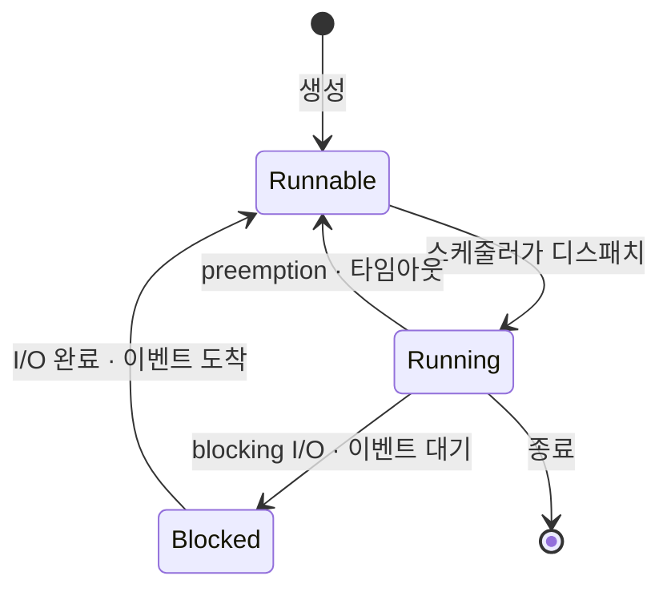
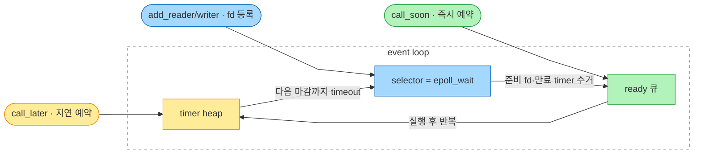

---
tags:
  - cs
  - python
  - golang
  - concurrency
  - parallelism
created: 2026-06-19T00:00:00
updated: 2026-07-05T23:10:21
permalink: /Dev/CS/concurrency-and-parallelism
---
> [!abstract]+ TL;DR
> - thread는 하드웨어·OS·user 세 층위라 이름만 같아 먼저 구분이 필요
> - 동시성은 겹쳐 다루는 구조, 병렬성은 여러 코어의 실제 동시 실행 — I/O-bound는 동시성, CPU-bound는 병렬로 해결
> - 실행 모델은 preemptive(OS thread)·cooperative(event loop)·M:N(goroutine) 세 갈래

> *AI-assisted*

---
### 1. CPU는 한 번에 하나씩 실행

CPU 코어 하나는 명령어를 순차적으로 실행한다. 한 순간에 진행되는 실행 흐름은 하나뿐이다. 현실의 요구는 다르다.

- 웹 서버는 수천 명의 요청을 동시에 받아야 한다
- 크롤러는 수백 개의 URL을 동시에 수집하려 한다
- 한 프로그램이 파일을 읽는 동안 네트워크 요청도 보내야 한다

OS는 CPU 시간을 잘게 쪼개 여러 작업에 번갈아 나눠줌으로써 이 요구를 메운다.   
코어 하나에서 매 순간 도는 흐름은 하나지만 전환이 충분히 빠르면 여러 작업이 함께 진행되는 것처럼 보인다.

> [!note]+ 물리 코어와 논리 코어 — SMT
> 최신 CPU는 물리 코어 하나를 논리 코어 두 개처럼 보이게 하는 기술을 갖는다(인텔의 [하이퍼스레딩](https://en.wikipedia.org/wiki/Hyper-threading), 일반적으로 [SMT](https://en.wikipedia.org/wiki/Simultaneous_multithreading)).   
> "4코어 8스레드" CPU는 물리 코어가 4개지만 OS에는 논리 코어가 8개로 보인다. 논리 코어가 많을수록 더 많은 흐름을 동시에 배치할 수 있으나, 같은 물리 코어의 [실행 자원을 나눠 쓰므로](https://blog.codingconfessions.com/p/simultaneous-multithreading) 성능이 물리 코어 수의 배수만큼 늘지는 않는다. 이 "8스레드"의 스레드가 다음 절에서 구분할 **하드웨어 thread**다.

---
### 2. 실행 단위 — process, thread, coroutine

> [!warning]+ "스레드"라는 말의 세 층위
> 같은 단어가 완전히 다른 층위를 가리킨다. 이름만 같아 헷갈리기 쉬우니 먼저 짚고 간다.
> - **하드웨어 thread**: 위에서 언급한 "4코어 8스레드"의 그 스레드. 논리 코어와 같은 말이고, CPU 스펙으로 물리적으로 정해진다.
> - **OS thread**(kernel-level thread): 프로그램이 만들고 kernel이 인식·스케줄링하는 실행 흐름(`threading.Thread`, pthread 등). 개수 제한이 없다.
> - **user thread**(user-level thread): kernel은 모르고 user space 런타임이 굴리는 경량 실행 흐름. 아래 coroutine과 10절 goroutine이 여기 속한다.
>
> 앞으로 그냥 "thread"라고 하면 kernel이 스케줄링하는 **OS thread**를 가리킨다.   
> OS는 이 OS thread들을 논리 코어(하드웨어 thread)에 번갈아 올리고, 논리 코어 하나가 한 순간에 실행하는 OS thread는 하나뿐이다.   
> user thread는 이 OS thread에 얹혀서 돈다.

"여러 일"을 담는 실행 단위는 세 층위다.

- **process**: 실행 중인 프로그램의 인스턴스
	- 각 process는 자기만의 독립된 메모리 공간이 있음
	- 다른 process의 메모리에는 직접 접근할 수 없고, 데이터를 주고받으려면 IPC(파이프, 소켓, 공유 메모리 등)가 필요
- **thread**: process 안의 더 작은 실행 흐름
	- 같은 process의 thread들은 메모리를 통째로 공유(힙, 전역 변수). 다만 각 thread는 자기만의 스택과 레지스터, program counter를 따로 가짐
	- OS(정확히는 kernel)가 인식하고 스케줄링하는 최소 단위
- **coroutine**: thread보다 한 겹 안쪽의 실행 단위
	- 중간에 멈췄다가 나중에 그 자리에서 재개할 수 있는 함수로, kernel은 이 존재를 모르고 하나의 thread 안에서 프로그램(런타임)이 스스로 관리 
	- 위에서 말한 user thread의 대표적인 형태이며, 자세한 동작은 9절 [[Concurrency and Parallelism#9. 두 갈래 — preemptive와 cooperative|event loop]]에서 다룸

|         | process          | thread            |
| ------- | ---------------- | ----------------- |
| 메모리     | 독립(격리)           | 같은 process 안에서 공유 |
| 통신      | IPC 필요           | 공유 메모리로 바로        |
| 생성 비용   | 무거움              | 상대적으로 가벼움         |
| 한쪽이 죽으면 | 다른 process 영향 적음 | process 전체 위험     |

메모리를 공유하는지 여부가 뒤에서 다룰 race condition과 병렬화 전략을 가른다.

셋을 "무엇을 자기 것으로 소유하느냐"로 보면, 모두 실행 상태를 담은 구체적 객체이되 소유 메모리가 아래로 갈수록 좁아진다.

| 실행 단위         | 자기 것으로 소유               | 공유하는 것             | 관리 주체          |
| ------------- | ----------------------- | ------------------ | -------------- |
| **process**   | 독립 주소 공간, 파일 디스크립터      | 없음(격리)             | kernel         |
| **thread**    | 자기 스택 + 레지스터·PC         | 소속 process의 주소 공간  | kernel         |
| **coroutine** | 자기 frame(지역 변수 + 재개 지점) | 소속 thread의 스택·힙 전부 | user space 런타임 |

process는 격리된 공간을 통째로, thread는 그 안에서 실행 컨텍스트(스택·레지스터)만, coroutine은 더 안쪽에서 중단된 frame만 자기 것으로 든다.  
coroutine도 추상 개념이 아니라 "중단 상태를 담은 실제 객체"(Python에선 `async def` 호출이 돌려줌)이다.

---
### 3. 이해를 위한 비유

이 글은 이후의 모든 설명을 **하나의 비유** 위에서 한다. 사무실에서 일꾼들이 서류를 처리하는 그림이다.

| 비유            | 실체                      | 핵심 성질                                    |
| ------------- | ----------------------- | ---------------------------------------- |
| **사무실**       | process                 | 자기 책상(주소 공간)과 자원을 가짐. 사무실끼리는 격리          |
| **업무 폴더**     | OS thread               | 북마크(program counter)와 중간 메모(스택·레지스터)를 품음 |
| **폴더 안 안건**   | coroutine (user thread) | 안건마다 자체 북마크. 폴더 안에서만 오감                  |
| **일꾼의 손**     | 논리 코어(하드웨어 thread)      | 한 순간에 폴더 하나만 잡음                          |
| **관리자**       | OS scheduler            | 어느 손에 어느 폴더를 쥐여줄지 배정                     |
| **처리 대기 바구니** | run queue               | 준비된 폴더가 손을 기다리는 줄. 손(코어)마다 하나씩           |
| **보류함**       | wait queue              | 외부 답변을 기다리느라 아직 처리 못 하는 폴더가 가는 곳         |

폴더(thread)는 수백 장, 일꾼의 손(논리 코어)은 몇 개뿐이다.   
한 손이 폴더 A를 잠깐 처리하다 **북마크를 남기고 내려놓고** 폴더 B를 집는다. 나중에 A를 다시 집으면 북마크부터 이어간다.   
이 "내려놓고 북마크 남기기"가 5절의 **context switch**다.

폴더 안에는 여러 **안건**(coroutine)이 들어 있을 수 있다.   
일꾼이 폴더를 잡으면 그 안 안건들을 번갈아 처리하는데 폴더를 바꾸는 일은 관리자(kernel)가 강제할 수 있지만 폴더 **안** 안건을 바꾸는 일은 프로그램이 폴더 내부에서 알아서 한다. kernel은 폴더 단위까지만 안다.

---
### 4. thread의 세 가지 상태

일하지 않는 폴더에도 종류가 있다. thread는 늘 셋 중 하나의 상태에 있다.

- **Running**: 지금 어떤 코어에서 실제로 돌고 있음 (일꾼 손에 들린 폴더)
- **Runnable**: 돌 준비는 됐는데 코어를 못 얻어 **run queue에서 차례를 기다림** (처리 대기 바구니 속 폴더). 코어만 나면 즉시 실행
- **Blocked**: I/O나 이벤트를 기다려 지금은 돌 수 없음 (보류함 속 폴더). run queue에도 없음

run queue는 보통 **논리 코어마다 하나씩** 있다(per-core run queue). 관리자(scheduler)는 어느 코어의 바구니에 폴더를 넣을지 배정하고, 각 코어는 자기 바구니에서 다음 폴더를 꺼내 처리한다.   

바구니가 채워지는 경로는 셋이다. 새로 생성된 thread, 선점당해 내려온 thread, 보류함에서 답변이 와 깨어난 thread다.

상태 전이를 그림으로 나타내면 이렇다. `[*]`은 thread의 생성과 종료를 나타내는 시작·끝 지점이다.



전환에는 두 계기가 있고, 이 둘이 완전히 다르다.

- **preemption**(선점): Running에서 시간 할당량(time slice)이 끝나 kernel이 강제로 뺏음
	- **run queue로 바로** 돌아감(Runnable)
	- 할 일은 남았고 코어만 나면 다시 실행
- **blocking**(대기): thread가 blocking I/O나 락을 **직접 호출**해 스스로 진행 못 하게 됨
	- **보류함으로** 이동(Blocked). 
	- 기다리던 이벤트가 와야 비로소 Runnable로 복귀

Blocked는 kernel이 "얘는 I/O를 자주 하니 미리 재우자"고 **예측**해서 만드는 상태가 아니다. thread가 blocking 연산을 **실제로 실행하는 순간**에만 일어난다.   
thread의 과거 이력은 우선순위 조정에만 쓰일 뿐, 상태를 강제로 Blocked로 바꾸지 않는다.

---
### 5. context switch — 전환의 비용과 단위

관리자가 폴더를 바꾸는 일에는 비용이 든다.   
OS scheduler는 CPU 시간을 잘게 쪼개 여러 thread에 번갈아 할당하는데(preemptive multitasking), 전환할 때 kernel은 두 가지를 한다.

1. 지금 돌던 thread의 상태(레지스터, 스택 포인터, program counter)를 저장한다
2. 다음 thread의 상태를 복원해 이어서 실행한다

이 저장·복원 과정이 **context switch**다. 두 특징이 중요하다.

- **kernel이 강제로 수행한다.** 실행 중인 코드는 자신이 언제 멈출지 모른다. 타이머 인터럽트로 OS가 끼어들어 흐름을 바꾼다.
- **비용이 든다.** 상태 저장·복원의 직접 비용에 더해, CPU 캐시가 무효화되는 간접 비용이 따른다. thread를 수천 개씩 띄우면 일하는 시간보다 전환하는 시간이 늘어 오히려 느려질 수 있다.

> [!note]+ 전환의 단위는 thread, 비용은 process 경계에서 커진다
> 전환의 실제 대상은 process가 아니라 thread다.   
> kernel 관점에서 thread와 process는 사실상 같은 스케줄 단위로 표현되고(리눅스에선 둘 다 `task_struct`), scheduler는 이 단위를 코어에 올리고 내린다.   process는 주소 공간·파일 디스크립터 같은 자원을 담는 컨테이너일 뿐이라, 관건은 지금 전환하는 thread가 어느 process에 속하느냐다.
> - **같은 process의 thread끼리**: 주소 공간을 공유하므로 레지스터·스택 포인터·PC만 갈아 끼우면 된다. 가볍다.
> - **다른 process의 thread로**: 여기에 주소 공간 전환(page table 교체, TLB flush)이 얹혀 더 비싸다.
> "process 간 전환이 무겁다"는 말은 process 자체를 바꿔서가 아니라, 다른 process의 thread로 넘어가며 주소 공간까지 바뀌기 때문이다.

전환 비용을 줄이려는 대표 장치가 **cache affinity**다.   
scheduler는 thread를 **이전에 돌던 코어**에 다시 올리려 한다. 그 코어의 캐시에 이 thread가 쓰던 데이터가 아직 남아(warm cache) 있을 가능성이 높기 때문이다.  
다만 캐시는 용량이 차면 오래된 것부터 밀려나므로(대략 LRU), 너무 오래 지났거나 그 사이 다른 thread가 그 코어를 휘저었으면 이미 식어(cold cache) 이득이 사라진다.   
그래서 cache affinity는 확정 보장이 아니라 **확률적 편향**이며, 부하가 한쪽에 몰리면 scheduler는 캐시 이득을 포기하고 thread를 다른 코어로 옮긴다.

이것이 흔히 말하는 "OS 레벨 context switch"다. kernel이 주도하고, 무겁고, 실행 중인 코드는 통제할 수 없다.   
이후에 소개할 event loop나 goroutine의 전환과는 성격이 다르다.

---
### 6. 동시성과 병렬성

동시성과 병렬성은 비슷해 보이지만 다른 개념이다. 이 둘을 구분하지 못하면 이후의 도구 선택이 전부 흐려진다.

- **concurrency**(동시성)는 여러 작업을 겹쳐서 다루는 능력이다. 
	- 한 순간에 논리 코어 하나가 한 가지 일만 하더라도, 작업 A를 조금 하다 B로 넘어가고 다시 A로 돌아오는 식으로 구성하면 밖에서 보기엔 여러 일이 함께 진행
	- 코어가 하나뿐이어도 동시성은 성립
- **parallelism**(병렬성)은 여러 작업이 실제로 같은 순간에 서로 다른 코어에서 실행되는 것이다. 
	- 물리적으로 동시에 도는 것이라 코어가 여러 개여야 가능

비유로 옮기면 선명하다.

- **동시성**: 일꾼 **한 명**이 폴더 여러 개를 번갈아 처리한다. 폴더 A를 조금 보다 B로, 다시 A로. 손이 하나라 물리적 동시 실행은 아니지만 밖에서는 여러 폴더가 함께 진행되는 것처럼 보인다.
- **병렬성**: 일꾼 **여러 명**이 각자 폴더를 하나씩 실제로 동시에 처리한다.

> [!tip]+ 한 문장 구분
> 동시성은 "여러 일을 다루는 구조"의 문제이고, 병렬성은 "여러 일을 동시에 하는 실행"의 문제다. Rob Pike의 표현으로 "Concurrency is not parallelism."

동시성은 병렬성의 전제가 될 수 있다. 작업을 잘게 쪼개 두면 코어가 늘었을 때 병렬로 돌릴 수 있다.   
둘은 같은 말이 아니다. 코어 하나로도 동시성은 가능하지만 병렬은 불가능하다.

---
### 7. CPU-bound와 I/O-bound

도구를 고르려면 먼저 작업이 느린 원인을 구분해야 한다.

- **CPU-bound**: CPU가 쉬지 않고 계산하느라 느린 작업. 
	- 큰 배열 정렬, 이미지·영상 변환, 암호화·압축, 머신러닝 전처리 등
	- 빨라지려면 계산을 더 많은 코어에 나눠야 함
- **I/O-bound**: CPU는 거의 놀고 외부 자원의 응답을 기다리느라 느린 작업. 
	- HTTP 응답 대기, DB 쿼리, 파일 읽기, 소켓 데이터 도착 대기 등
	- 빨라지려면 기다리는 시간을 서로 겹쳐야 함

이 구분이 도구 선택의 갈림길이다.

- 계산이 오래 걸리는 문제(CPU-bound)는 "어떻게 여러 코어를 쓸까", 곧 **병렬성**의 문제다.
- 대기가 오래 걸리는 문제(I/O-bound)는 "기다리는 동안 다른 일을 어떻게 시킬까", 곧 **동시성**의 문제다.

CPU와 네트워크의 속도 차는 크다. CPU 연산은 네트워크 왕복보다 10만 배 이상 빠르다.  
그래서 네트워크 I/O가 많은 프로그램은 전체 시간의 대부분을 대기로 흘려보내며, 이 대기를 겹치는 것만으로 체감 속도가 크게 오른다.

---
### 8. 직교하는 두 축 — synchronous/asynchronous, blocking/non-blocking

7절에서 I/O-bound의 해법은 "기다리는 시간을 서로 겹치는 것"이라 했다. 그러려면 하나의 호출이 기다리는 동안 어떻게 행동하는지부터 정리해야 한다.   
여기엔 서로 다른 두 질문이 섞여 있다: 기다리는 동안 **호출자의 흐름이 멈추나**, 완료를 **내가 챙기나 통지받나**.   

자주 한 덩어리로 뭉뚱그려지지만 사실은 독립된 두 축이고, 뒤에 나올 event loop·`await`·Future가 전부 이 조합으로 설명된다.

#### synchronous / asynchronous — "완료를 내가 묻나, 배달되나"

호출과 결과가 시간적으로 묶여 있는지를 가른다. 더 또렷하게는 **결과를 얻을 책임이 호출한 흐름에 있느냐, 통지 메커니즘에 넘어가느냐**의 문제다. 여기서 "흐름"은 OS thread가 아니라 호출 스택 혹은 호출을 실행한 코루틴을 의미한다.

- **synchronous**: 결과를 호출한 흐름이 직접 얻는다 (pull). 
	- 기다려서 받든 되물어서 받든, "끝났나?"를 확인하는 주체가 호출한 흐름 자신으로 결과가 나오기 전엔 그 흐름이 호출 지점을 벗어나지 못함
	- "요청 → 기다림/확인 → 결과 사용"이 한 흐름으로 이어짐
- **asynchronous**: 호출한 흐름은 작업만 걸어두고 제어를 놓는다 (hand off).
	- 완료 확인은 흐름이 아니라 런타임(event loop 등)이 맡고, 끝나면 콜백·이벤트·`await` 재개로 결과가 배달된다(push)
	- 내가 다시 묻지 않아도 통지가 오고(`await`, 콜백, `Future.result()` 등), "작업 시작"과 "결과 소비"가 분리된다

식당으로 치면 synchronous는 카운터에 서서 기다리거나(blocking) 10초마다 "됐어요?"를 되묻는 것(non-blocking)이고,   
asynchronous는 진동벨을 받아 자리에서 딴 일을 하다 벨이 울리면 받으러 가는 것이다. 이 진동벨이 콜백·이벤트 통지이며, 내가 안 물어봐도 저쪽이 알려준다는 게 asynchronous의 본질이다.

이 진동벨을 객체로 만든 것이 **Future**다(언어에 따라 Promise).   
async 호출은 결과 대신 빈 상자(Future)를 즉시 돌려주고, 작업이 끝나면 그 상자가 채워진다. `future.result()`로 내가 값을 부르면 pull(아직이면 그 자리서 blocking으로 기다리거나 `asyncio`의 경우 exception을 던짐), `await`나 완료 콜백으로 통지받으면 push다.   

Future 자체는 결과가 담길 자리일 뿐이고, 실제 작업은 **Executor**(스레드풀·프로세스풀)나 event loop가 수행해 채운다.   
(`await`·event loop의 동작은 9절, `Executor`는 16절에서 이어짐)

단, 이 구분은 **결과가 이 스레드 밖에서 나오는 호출**에서만 의미가 있으며 이는 I/O(네트워크·파일·DB·타이머)가 이에 해당한다.   
순수 계산 함수(`compute(x)` 같은 로컬 호출)는 이 스레드가 자기 CPU로 직접 실행하니 "나중에 받는다"는 선택지가 없어 언제나 synchronous다. 계산을 async로 돌리려면 다른 스레드·프로세스에 위임해야 하고, 그 순간 그 호출은 이미 I/O처럼 "맡기고 나중에 회수"하는 구조가 된다.

#### blocking / non-blocking — "기다리는 동안 호출자의 흐름이 멈추나"

제어권의 진행 여부를 가른다. 이 축은 앞서 언급했던 [[Concurrency and Parallelism#4. thread의 세 가지 상태|thread의 상태]]로 곧장 대응된다.

- **blocking**: 작업이 끝날 때까지 현재 실행 흐름이 멈춤
	- 정확히는 "필요하면 기다릴 의향"이라, 실제로 기다려야 할 때 kernel이 그 thread를 재워 **Blocked**로 보냄
	- 데이터가 이미 준비돼 있으면 blocking 호출도 안 자고 바로 돌아옴
- **non-blocking**: 지금 당장 끝낼 수 없으면 즉시 제어권을 돌려줌
	- thread는 멈추지 않고 **Running/Runnable**을 유지하며, 결과는 나중에 다시 확인하거나 통지받는다.

> [!note]+ sync/async가 헷갈리는 이유
> blocking/non-blocking은 thread의 CPU 상태, 즉 Running이냐 Blocked냐로 그대로 매핑되는 machine 동작 자체라 직관적이다.   
> 
> 반면 synchronous/asynchronous는 대응되는 CPU 상태가 없다.   
> 하드웨어 상태가 아니라 "완료를 pull 하느냐 push 받느냐"는 제어 흐름의 계약이라 한 단계 더 추상적이다.   
> 
> 또 하나의 함정은 "확인하는 주체"를 thread로 오해하는 것이다. 단일 thread `asyncio`에선 완료를 확인하는 event loop도 결국 **같은 thread**에서 돈다. 물리적 thread는 같아도 논리적으로 **확인하는 흐름**이 다르다: synchronous는 호출한 코루틴 자신이, asynchronous는 event loop이 확인한다. 그래서 이 축은 "어느 thread가 처리하나"가 아니라 "호출한 흐름이 결과 확인에 매여 있나"로 봐야 한다.
> 
> 둘이 서로 다른 층위의 질문이라 직교하고, 그래서 조합이 넷 나온다.

#### 두 축을 2×2로 보면

|                  | blocking                                                | non-blocking                                 |
| ---------------- | ------------------------------------------------------- | -------------------------------------------- |
| **synchronous**  | 가장 흔함. `requests.get()`, 기본 소켓 `recv()`, `time.sleep()` | 저수준에서 가능. non-blocking 소켓을 `recv()`로 즉시 확인   |
| **asynchronous** | 거의 없음(사실상 안티패턴)                                         | `asyncio`의 이상형. `await`로 등록하고 즉시 양보, 결과는 나중에 |

- **sync + blocking**: 결과를 직접 기다리고, 나올 때까지 thread가 **Blocked**로 잠든다. 가장 흔한 형태다.
- **sync + non-blocking**: 결과를 직접 확인하되 아직이면 즉시 돌아오고, 준비될 때까지 **되묻는다**(polling). thread는 Running을 유지한다.
- **async + blocking**: 통지를 등록해 놓고 그 통지를 다시 blocking으로 기다리는 꼴이라 두 방식의 이점이 상쇄되는 **안티패턴**이다.
- **async + non-blocking**: 등록하고 즉시 양보한 뒤 결과는 나중에 통지받는다. `asyncio`의 이상형이다.


여기서 흔히 생기는 대표적인 오해들을 짚고 넘어가자

- "asynchronous = 빠름"이 아니다.
	- asynchronous는 흐름 제어 방식일 뿐이다.
- "synchronous = CPU를 오래 쓴다"도 아니다.
	- synchronous 호출도 대부분의 시간을 대기로 보낼 수 있다. 
	- blocking I/O 중에는 그 thread가 Blocked로 가고 코어는 다른 thread가 쓴다(4절).
- synchronous + non-blocking은 가능하다. 
	- non-blocking 소켓을 `while True: recv()`로 계속 확인하는 방식인데, 이러면 CPU를 태우는 busy polling이 된다.
	- 그래서 보통은 OS의 감시 기능(`select`·`epoll`)으로 준비된 자원만 확인한다(11절). 
	- 다만 저지연이 관건인 시스템(고빈도 트레이딩, 커널 우회 패킷 처리)에서는 thread를 재웠다 깨우는 지연조차 아까워, 이 [[Busy Polling and Spinlock|busy polling을 일부러 쓰기도 한다]].

---
### 9. 두 갈래 — preemptive와 cooperative

이제 이 토대 위에서 구현된 동시성은 크게 두 갈래이고, 전환이 누가·언제·얼마나 비싸게 일어나는지에서 갈린다.   
하나는 kernel이 강제로 흐름을 바꾸는 **preemptive**, 다른 하나는 코드가 스스로 실행권을 넘기는 **cooperative**다.

#### (A) OS thread 간 전환 — preemptive

5절에서 본 대로 kernel이 강제로 context switch 한다.   
코드는 평범한 synchronous 방식으로 짜고, OS가 알아서 번갈아 돌린다. thread는 메모리를 공유하고, process는 격리된다.

- 전환의 주체: kernel(강제, 코드는 알지 못함)
- 비용: 큼(kernel 경유 + 캐시 영향)
- 병렬: 가능(여러 코어에 실제로 배치)
- 위험: 공유 메모리 thread의 race condition, 전환 비용

#### (B) coroutine 간 전환 — cooperative

하나의 OS thread 안에서 여러 coroutine이 돌아갈 때, 그 위에서 **event loop**가 무한 루프를 돌며 실행할 수 있는 coroutine을 골라 돌린다.   
한 coroutine이 `await`로 대기에 들어가면 event loop는 그것을 제쳐두고 다음 coroutine으로 넘어가며, 대기가 끝나면 멈췄던 지점부터 재개한다.   
코드가 `await`에서 스스로 실행권을 넘기므로 이 방식을 **cooperative multitasking**이라 한다. kernel을 거치지 않는 유저 공간 전환이라 비용이 작다.

비유로 옮기면, 이건 **안건이 잔뜩 든 폴더 하나**다. 일꾼의 손(논리 코어)이 하나뿐인 이 폴더를 잡고, 그 안 안건(coroutine)들을 번갈아 처리한다.   
한 안건이 "외부 답변 대기"(`await`)에 걸리면 자체 북마크를 남기고 같은 폴더의 다음 안건으로 넘어간다. 폴더가 하나라 손이 열 개여도 한 손만 이 폴더를 잡을 수 있어 병렬은 되지 않는다. 대신 안건들의 대기 시간이 서로 겹쳐지니 일꾼이 노는 시간 없이 여러 안건을 밀어붙인다.

> [!note]+ event loop은 실행 단위가 아니라 "스케줄러 객체"다
> process·thread·coroutine이 각자 실행 상태를 담은 실행 단위라면, event loop은 그것들을 고르고 굴리는 **구동기**다.   
> 추상 개념만이 아니라 구현에선 실행 준비된 것들을 담아 두고 하나씩 꺼내 돌리는 구체적 객체이며 그것이 든 "메모리"는 실행 컨텍스트가 아니라 무엇을 다음에 돌릴지 적은 관리자의 장부다. 
> 
> **관리자** 역할을 kernel이 아니라 user space에서 맡는 셈이며, 그 내부 자료구조와 한 바퀴의 동작은 11절에서 자세히 본다.

- 전환의 주체: 코드 자신(`await` 지점에서 자발적으로)
- 비용: 작음(유저 공간, kernel 거치지 않음)
- 병렬: 불가능(단일 thread라 매 순간 하나만 실행)
- 장점: 전환 지점이 코드에 `await`로 드러나 추적하기 쉬움
- 함정: 한 coroutine이 양보하지 않고 오래 붙잡으면 event loop 전체가 멈춤

> [!info]+ coroutine이 가벼운 이유
> 일반 함수는 호출되면 스택 프레임이 쌓이고 끝나면 사라진다. 중간에 멈췄다 재개하기 어렵다.   
> 
> coroutine은 "어디까지 실행했는지, 다음에 어디서 재개할지, 지역 상태가 무엇인지"를 객체 형태의 가벼운 실행 상태로 들고 다닌다.  
>  덕분에 OS thread보다 훨씬 많은 수를 띄울 수 있다. thread가 각자 큰 스택을 미리 잡아두는 것과 대비된다.

"asynchronous 처리가 OS의 context switch와 무엇이 다른가"라는 질문의 답이 앞 (A)·(B)의 대비에 있다.   
OS thread의 전환은 kernel이 강제하는 무거운 전환이고, event loop의 전환은 코드가 `await`에서 자발적으로 하는 가벼운 전환이다.   
같은 "전환"이라는 단어를 쓰지만 주체와 시점, 비용이 다르다. 여기에 goroutine까지 더한 세 모델 비교는 다음 절 끝 표에 있다.

---
### 10. 제3의 길 — M:N runtime과 goroutine

앞의 두 모델은 각각 대가가 있다. 
- OS thread는 진짜 병렬을 줄 수 있지만 전환이 무겁고, 수가 많아지면 부담이 커진다.   
- event loop는 가볍지만 단일 thread라 병렬이 되지 않는다.   

이 둘의 장점, 곧 preemptive의 병렬과 cooperative의 가벼움을 합치려는 것이 언어 런타임이 실행 흐름을 직접 관리하는 **M:N 모델**이다.

user thread를 OS thread에 몇 대 몇으로 얹느냐가 threading model을 가른다.

- **1:1**: user thread 하나에 OS thread 하나
	- Python `threading`, 리눅스 `pthread`가 이 방식이라 둘의 구분이 잘 드러나지 않는다.
- **N:1**: 여러 user thread를 OS thread 하나에
	- event loop의 coroutine들이 해당
	- kernel이 하나로만 인식하기 때문에 병렬이 안 된다.
- **M:N**: 여러 user thread를 여러 OS thread에
	- 병렬이 되며, 아래 goroutine이 대표적인 예시

Go의 **goroutine**이 그 M:N의 대표 사례다.   
수많은 goroutine을 적은 수의 OS thread 위에 Go 런타임이 매핑해 돌린다. goroutine이 채널·I/O·시스템 콜에서 막히면 런타임이 그 goroutine을 빼두고 같은 OS thread에 다른 goroutine을 올린다.   
이 전환도 유저 공간에서 일어나 비용이 작고 런타임은 여러 OS thread를 동시에 쓰므로 진짜 병렬도 가능하다.

- 전환의 주체: 언어 런타임(막히는 지점 + 런타임의 선점)
- 비용: 작음(유저 공간)
- 병렬: 가능(여러 OS thread에 분산)
- 한 줄 요약: preemptive의 진짜 병렬과 cooperative의 가벼움을 합친 자리

이 발상은 Go만의 것이 아니다.   
Java의 virtual thread(Project Loom), Erlang·Elixir의 경량 process도 런타임이 경량 실행 흐름을 소수의 OS thread에 실어 나르는 같은 갈래다. 

#### threading model 비교

| 모델                      | 누가 전환하나     | 언제           | 비용        | 진짜 병렬?        | 코드 모습              |
| ----------------------- | ----------- | ------------ | --------- | ------------- | ------------------ |
| OS thread (preemptive)  | kernel이 강제로 | OS가 임의 시점에   | 큼(kernel) | O             | 평범한 synchronous 코드 |
| coroutine (cooperative) | 코드가 스스로     | `await` 지점에서 | 작음(유저)    | X (단일 thread) | `async`/`await` 표시 |
| goroutine (M:N)         | 런타임이        | 막히는 지점 + 선점  | 작음(유저)    | O             | 평범한 synchronous 코드 |

---
### 11. 비동기 I/O의 실제 동작

단일 thread event loop가 수천 개의 소켓을 동시에 다룰 수 있는 건 OS의 [[IO Multiplexing - select, poll, epoll|I/O multiplexing]] 덕분이다. 원리는 단순하다.

- 수천 개의 소켓을 일일이 blocking으로 하나씩 기다리는 대신,
- `epoll_wait`으로 OS에 "이 중 준비된 fd만 알려달라"고 맡긴다.

이 통지를 받아 준비된 것만 골라 처리하는 게 event loop이다. 9절에서 "스케줄러 객체"라 부른 그 내부를 뜯어보자.

#### 세 자료구조와 입력원

먼저 용어를 맞추자. 세 구조에 담기는 건 coroutine 자체가 아니라 **콜백**(asyncio 내부에선 `Handle`)이다. 이 콜백을 실행하면 묶인 coroutine이 다음 `await`까지 재개된다.   
편의상 "coroutine이 파킹됐다"고 말하지만, 실제로 든 건 그 재개 콜백 곧 **continuation**이다.

event loop은 이 콜백들을 세 자료구조에 나눠 담는다. 콜백이 "언제 실행돼야 하나"로 갈린다.

- **ready 큐**: 지금 당장 실행할 콜백의 대기열 (즉시 실행)
- **timer heap**: 시각순으로 정렬된 예약. 맨 앞이 가장 이른 예약 (시각 도래)
- **selector**: `epoll`을 감싼 래퍼. "어떤 fd를 감시 중이고 준비되면 어떤 콜백을 깨우나"의 매핑을 든다 (fd 준비)

콜백이 이 세 구조에 처음 들어가는 primitive 경로는 셋뿐이고, 나머지 API는 전부 그 위에 얹혀 있다.

| primitive                            | 처음 놓이는 곳       | ready 큐로 들어가는 계기       |
| ------------------------------------ | -------------- | ---------------------- |
| `loop.call_soon(cb)`                 | ready 큐 **직행** | 즉시. 다음 바퀴에 실행          |
| `loop.call_later(d, cb)` · `call_at` | timer heap     | 그 시각이 지나면 이동           |
| `loop.add_reader/add_writer(fd, cb)` | selector       | epoll이 그 fd 준비를 알리면 이동 |

**ready 큐로 직행하는 건 `call_soon`뿐**이다.   
timer heap과 selector는 대기소라, 거기 든 콜백은 "시각 도래"나 "fd 준비"라는 계기가 있어야 ready 큐로 옮겨진다.

상위 API는 전부 이 셋으로 환원된다.

- `asyncio.create_task(coro)` → 첫 스텝을 `call_soon` → ready 큐 직행
- Future 완료(`set_result`/`set_exception`) → 걸린 done 콜백을 `call_soon`으로 → ready 큐
- `asyncio.sleep(d)` → `call_later` → timer heap
- `await sock.recv()`·`reader.read()`·`writer.drain()` → `add_reader`/`add_writer` → selector
- `asyncio.wait_for(coro, t)`·`timeout(t)` → I/O는 selector, 데드라인은 timer heap에 **둘 다**
- `call_soon_threadsafe(cb)`·`run_in_executor` 결과 → 타 스레드가 ready 큐에 넣고 `epoll_wait`을 깨움

> [!note]+ `call_soon`·`call_later`은 loop의 메서드
> `asyncio.call_soon` 같은 모듈 함수가 아니라 `loop.call_soon(cb)` 꼴로 loop 객체에 붙어 있고, coroutine이 아니라 평범한 콜백을 받는다. 직접 부를 일은 드물고 `sleep`·`timeout`·`create_task`가 내부에서 부른다. 

#### event loop 한 바퀴가 하는 일

event loop은 이름 그대로 하나의 OS thread 위에서 `while` 무한 루프를 돈다. 한 바퀴는 대략 이렇다.

1. timer heap 맨 앞을 보고 **다음 예약까지 남은 시간**을 계산한다. 이게 다음 단계의 제한 시간이 된다.
2. 그 시간을 제한으로 selector를 경유해 `epoll_wait`을 부른다.
	- 감시 중인 fd가 준비되면 즉시 깨고, 아무것도 없으면 timer 시각까지 잔다 → **loop이 유일하게 blocking되는 지점**
	- ready 큐에 이미 콜백이 있으면 대기 없이 지나간다
3. 깨어나면 selector의 준비된 fd 콜백과 timer heap의 만료된 콜백을 ready 큐로 옮긴다. `call_soon`으로 이미 들어와 있던 콜백까지, 이 셋이 이번 바퀴에 실행할 목록이다.
4. 이번 바퀴 시작 시점에 큐에 있던 콜백을 하나씩 실행한다. 각 콜백이 묶인 coroutine을 다음 `await`까지 굴리고, 실행 중 새로 걸린 콜백은 다음 바퀴로 넘긴 뒤 1로 돌아간다.

눈여겨볼 점은 **timer와 I/O가 한 번의 `epoll_wait`으로 통합된다**는 것이다. fd가 하나도 준비 안 돼도 다음 timer 시각엔 깨야 하므로, loop은 "다음 예약까지"를 제한 시간으로 넘겨 두 이벤트원을 한 대기로 합친다.



이 세 구조의 협력 골격은 asyncio 전용이 아니라 **reactor 패턴**으로, Node의 libuv·Go 런타임·nginx도 이름만 달리 같은 구조를 쓴다.  
timer가 heap이냐 wheel이냐, 뒷단이 epoll이냐 kqueue냐 정도만 갈린다.

#### 콜백 하나의 이동 양상

이제 콜백 하나가 여러 `await`를 거치며 세 구조 사이를 어떻게 옮겨 다니는지 따라가 보자.

```python
async def handle(reader, writer):
    data = await reader.read(100)   # ① 읽기 I/O 대기
    await asyncio.sleep(0.5)        # ② 시간 대기
    writer.write(process(data))
    await writer.drain()            # ③ 쓰기 I/O 대기
```

`asyncio.create_task(handle(...))`로 띄우면 그 continuation이 이렇게 이동한다.

1. **시작**: 첫 스텝 콜백이 `call_soon`으로 **ready 큐**에 올라가 실행되고, `await reader.read(100)`에서 멈춘다.
2. **selector**: `read`가 소켓 fd를 selector에 등록하며 continuation을 파킹한다. epoll이 "그 fd 읽기 준비"를 알리면 콜백이 **ready 큐로 이동**해 실행되고, 데이터를 받은 뒤 `await asyncio.sleep(0.5)`에서 멈춘다.
3. **timer heap**: `sleep`이 `call_later`로 0.5초 뒤 continuation을 timer heap에 넣는다. 0.5초가 지나면 만료된 콜백이 **ready 큐로 이동**해 실행되고, `writer.write()` 뒤 `await writer.drain()`에서 멈춘다.
4. **selector**: 쓰기 버퍼가 차 있으면 `drain`이 fd를 쓰기 감시로 selector에 등록하고 대기한다(여유가 있으면 안 멈추고 통과). "쓰기 가능" 알림에 콜백이 **ready 큐로 이동**해 재개되고 coroutine이 끝난다.

이동 경로만 뽑으면 `ready 큐 → selector → ready 큐 → timer heap → ready 큐 → selector → ready 큐`다.   
매번 "대기소에 파킹 → 계기(fd 준비·시각 도래) → ready 큐로 이동 → 실행"을 반복하고, **실행은 언제나 ready 큐를 거친다.**

#### epoll과 event loop의 분업

정리하면 **asynchronous I/O는 두 층의 조합**이다.

1. **OS의 준비완료 통지**(epoll): 어떤 fd가 준비됐는지 커널이 알려준다.
2. **cooperative yield**(`await`): coroutine이 대기 지점에서 실행권을 넘겨, 그동안 loop이 준비된 다른 콜백을 처리한다.

그래서 "loop은 epoll이 준 fd만 스케줄링하는 얇은 층 아니냐"는 절반만 맞다.  
**수천 fd를 감시하는 무거운 일은 커널**(`epoll`)이 대신 지고, loop은 busy polling 없이 `epoll_wait`에서 자다 깨면 된다.   

대신 loop이 직접 지는 몫도 분명하다
- fd와 콜백의 매핑
- timer heap 유지
- `await`로 멈춘 coroutine의 중단·재개
- ready 큐 소진  

어려운 감시는 커널에 맡기고 자신은 "누구를 언제 깨울지"만 관리하는 분업이다.

> [!note]+ synchronous + non-blocking polling과의 차이
> 8절에서 본 "non-blocking 소켓을 직접 반복 확인"하는 방식은 준비됐는지 계속 물어보느라 CPU를 태운다(busy polling).
> epoll은 "준비되면 알려주겠다"는 감시 역할이라 그 낭비가 없다. 다만 epoll 자체는 통지만 할 뿐, 실제로 데이터를 가져오는 `recv()` 호출은 여전히 필요하다.
>
> 여기서 층위를 나눠야 한다. 준비된 자원에 non-blocking `recv()`를 부르는 **저수준 호출 자체**는 그 자리서 결과를 받으니 8절의 synchronous + non-blocking이고, busy polling의 되묻는 낭비가 없는 건 sync/async 때문이 아니라 **epoll 통지** 덕이다.
>
> `asyncio`는 이 저수준 메커니즘(epoll 통지 + non-blocking `recv()`)을 event loop로 감싸, 프로그래머에게는 `await`로 등록하고 나중에 받는 **asynchronous + non-blocking**으로 보이게 추상화한다.

---

### 12. 진짜 병렬은 언제 가능한가

진짜 병렬은 여러 코어에서 여러 실행 흐름이 실제로 같은 순간에 배치되는 것이다. 필요조건은 두 가지다.

1. 코어가 여러 개일 것
2. 여러 OS thread·process가 실제로 그 코어들에 배치될 것

핵심은 **논리 코어에 올라가 실행되는 것은 언제나 OS thread**라는 점이다.   
process도 결국 그 안의 thread가 코어에 올라가고, user thread(coroutine·goroutine)는 자신을 태워줄 OS thread가 있어야 돈다.  

그래서 병렬 여부는 "그 모델이 여러 OS thread를 여러 코어에 실제로 올리느냐"로 갈린다 — 단일 OS thread인 event loop만 병렬이 안 되고, 여러 process·여러 OS thread·goroutine은 병렬이 된다.

동시성은 구조라서 코어가 하나여도 성립하지만 병렬성은 물리적 실행이라 여러 코어와 여러 OS 실행 단위가 실제로 필요하다.

---
### 13. GIL — Python의 제약

Python thread가 병렬에서 제약을 받는 이유는 **GIL**(Global Interpreter Lock)이다.   
CPython 인터프리터에는 한 순간에 하나의 thread만 Python 바이트코드를 실행하도록 막는 잠금이 있다.

결과는 두 가지다.

- thread를 여러 개 만들어도 순수 Python CPU 연산은 한 번에 하나씩만 돈다. 그래서 CPU-bound 작업을 thread로 나눠도 빨라지지 않고, 전환 비용 탓에 오히려 느려질 수 있다.
- 반면 I/O 대기 중에는 GIL이 풀린다. 네트워크·파일 대기, 일부 C 라이브러리 호출 구간에서는 다른 thread가 진행할 수 있다. 그래서 I/O-bound 작업에는 Python thread도 충분히 쓸모 있다.

> [!warning]+ 흔한 오해
> "Python은 동시성이 안 된다"는 틀린 말이다. 정확히는 **"CPython에서 순수 Python CPU 연산을 thread로 병렬화하는 데 제약이 있다"**는 뜻이다. I/O 동시성은 thread로도, `asyncio`로도 잘 된다. CPU 병렬이 필요하면 `multiprocessing`으로 별도 process를 띄워 GIL을 우회하거나 네이티브 확장으로 간다.

GIL은 CPython의 사정일 뿐 보편 법칙이 아니다.   
Go·Java·C++ 같은 언어에는 GIL이 없어서 thread나 goroutine이 여러 코어에서 곧바로 병렬로 돈다. Go의 goroutine이 CPU-bound에도 강한 이유가 여기에 있다.   
Python도 3.13부터 GIL을 끄는 실험적 빌드를 도입하기 시작했으나, 아직 기본은 GIL이 있는 모델이다.   

GIL이 왜 필요한지(참조 카운팅)와 커널과 무관한 그 내부 동작은 [[Python GIL]]에서 다룬다.

---
### 14. 경쟁 조건과 동기화

동시성에는 대가가 따른다. 여러 실행 흐름이 같은 자원(변수·파일)을 동시에 건드리면, 실행 순서에 따라 결과가 달라지는 버그가 생긴다.   
이를 **race condition**이라 한다.

방지하는 방법은 공유 자원에 동시에 접근하지 못하도록 순서를 강제하는 것이다.   
`lock`, `mutex`, `semaphore` 같은 동기화 도구로 critical section을 직렬화한다. 셋은 목적은 같지만 성격이 다르다.

| 도구            | 동시 허용 | 소유권            | 핵심                         |
| ------------- | ----- | -------------- | -------------------------- |
| **lock**      | 보통 1  | 구현마다           | 잠금의 총칭이자 기본 상호 배제          |
| **mutex**     | 1     | 있음 (잠근 흐름만 해제) | critical section을 한 번에 하나씩 |
| **semaphore** | N     | 없음             | 동시 접근을 N개로 제한, 신호 전달       |

**mutex**는 "소유권 있는 1개짜리"(화장실 열쇠 하나), **semaphore**는 "소유권 없는 N개짜리"(주차장 빈자리 N개)로 기억하면 쉽다.   
구체적 API는 언어·라이브러리마다 다르다.

> [!info]+ 용어가 느슨한 이유 — "lock"은 통칭이다
> 실무에서는 lock과 mutex를 거의 혼용한다. "lock을 건다"고 하면 보통 mutex를 뜻하지만, **"lock"이라는 이름 자체는 소유권 유무를 특정하지 않는다.** 그래서 같은 "Lock"이라도 구현마다 성격이 다르다.
> - Go `sync.Mutex`: 이름도 Mutex고 **소유권 있는 진짜 mutex**다(잠근 goroutine만 해제).
> - Python `threading.Lock`: 이름은 Lock이지만 **소유권이 없다**(다른 thread가 release 가능). 엄밀히는 binary semaphore에 가깝고, 소유권 있는 버전은 `threading.RLock`이다.
>
> 정확히 가르려면 **소유권 유무와 개수** 두 가지를 본다.
>
> | 소유권 | 개수 | 이름 |
> |---|---|---|
> | 있음 | 1 | **mutex** |
> | 없음 | 1 | **binary semaphore** (흔히 그냥 "lock") |
> | 없음 | N | **counting semaphore** |
>
> "소유권 없는 잠금"을 콕 집는 정식 용어가 binary semaphore이고, 실무에선 이것도 그냥 "lock"이라 부른다.

파일에 거는 잠금도 같은 갈래다.   
리눅스의 [[Shell Script Concurrency and flock|flock]]은 소유권 있는 상호배제라 mutex의 성질을 갖지만 메모리가 아니라 **파일 시스템 레벨**의 잠금이고 소유 단위가 thread가 아니라 프로세스(파일 디스크립터)다. 그래서 주로 **프로세스 간** 상호배제(예: 스크립트 단일 실행 보장)에 쓰며, "프로세스 간 뮤텍스"로 이해하면 된다.

모델마다 위험도가 다르다.

- **공유 메모리 thread**: 위험이 가장 크다. 아무 때나 preemption되므로 두 thread가 같은 변수를 동시에 건드리기 쉽다. lock 관리와 deadlock까지 신경 써야 한다.
- **event loop**: 단일 thread라 "둘이 같은 줄을 동시에 실행"하는 경쟁은 없다. 다만 `await`로 양보하는 사이에 상태가 바뀔 수 있어 완전히 자유롭지는 않다. 이 `await` 경계를 보호할 때는 event loop를 막는 `threading.Lock`이 아니라 `asyncio.Lock`을 쓴다. 전환 지점이 `await`로 드러나 추적은 쉽다.
- **여러 process**: 메모리가 격리돼 공유 메모리 경쟁은 없다. 대신 공유 파일·DB 같은 외부 자원에 대한 경쟁은 여전히 존재한다.

> [!tip]+ Go의 접근 — channel
> Go는 lock으로 공유 메모리를 지키는 대신, **channel**이라는 통로로 goroutine끼리 값을 주고받게 권한다. 유명한 격언이 이를 압축한다.  
> > 메모리를 공유해서 소통하지 말고, 소통해서 메모리를 공유하라.  
> > (Don't communicate by sharing memory; share memory by communicating.)  
> Go에도 `sync.Mutex`는 있으나, 기본 발상은 "공유 상태를 여럿이 건드리지 말고 값을 통로로 넘겨라"다. 

---
### 15. 동시성 층위 한눈에

지금까지의 실행 모델을 하나의 지도로 모으면 두 축으로 갈린다.   
하나는 **단위의 계층**(process ⊃ OS thread ⊃ user thread)이고, 다른 하나는 user thread를 OS thread에 얹는 **매핑**(N:1 / M:N)이다.

```
process (독립 메모리) ─────── 여러 개 = 멀티프로세싱
  └ OS thread (메모리 공유) ── 여러 개 = 멀티스레딩
      └ user thread (kernel은 모름, 런타임·루프가 관리)
          ├ N:1 → event loop + coroutine
          └ M:N → goroutine / virtual thread
```

`process ⊃ OS thread ⊃ user thread`는 **포함 관계**이고, N:1과 M:N은 **user thread 층에서만** 갈린다. event loop와 goroutine은 부모-자식이 아니라 **형제**다.

| 모델         | 늘리는 단위            | 메모리             | kernel이 아나 | 전환·스케줄                  | 동시성 | 진짜 병렬     | 대표                        |
| ---------- | ----------------- | --------------- | ---------- | ----------------------- | --- | --------- | ------------------------- |
| 멀티프로세싱     | process           | 완전 격리           | O          | kernel(선점)              | O   | O         | `multiprocessing`         |
| 멀티스레딩      | OS thread         | 공유              | O          | kernel(선점)              | O   | GIL 없으면 O | `threading`, Java thread  |
| event loop | user thread (N:1) | 같은 OS thread 1개 | X          | event loop(협력, `await`) | O   | X         | asyncio, JS               |
| M:N 런타임    | user thread (M:N) | 런타임 관리          | X          | 런타임(협력 + 선점)            | O   | O         | goroutine, virtual thread |

**동시성은 네 층위 모두 O**다 — 넷 다 "여러 일을 겹쳐 다루는" 동시성 도구다.   
갈리는 건 **진짜 병렬**이며, N:1 event loop만 단일 OS thread라 X다.

언어별로 주로 어느 층위를 쓰는지 보면 이렇다.

| 언어              | process        | OS thread (멀티스레딩)              | N:1 event loop | M:N                |
| --------------- | -------------- | ------------------------------ | -------------- | ------------------ |
| Python          | O              | O (I/O 동시성 O, CPU 병렬은 GIL이 막음) | O (asyncio)    | 표준엔 없음             |
| Go              | 드묾             | M:N의 하부                        | —              | O (goroutine)      |
| Java            | 가능             | O (병렬)                         | 라이브러리          | O (virtual thread) |
| JS / Node       | worker·cluster | worker_threads                 | O (핵심)         | —                  |
| Erlang / Elixir | —              | 하부                             | —              | O (경량 프로세스)        |

---
### 16. 어떤 도구를 언제 쓰나

지금까지의 틀 위에 실제 도구를 배치하면 다음과 같다.

| 도구                                               | 실행 모델                             | 주는 것                  | 적합한 작업                 |
| ------------------------------------------------ | --------------------------------- | --------------------- | ---------------------- |
| Python `threading` / `ThreadPoolExecutor`        | OS thread(preemptive)             | 동시성 (CPU 병렬은 GIL이 막음) | I/O-bound, 적은 수의 동시 작업 |
| Python `asyncio`                                 | 단일 thread event loop(cooperative) | 동시성                   | 대량 I/O-bound(수천-수만 연결) |
| Python `multiprocessing` / `ProcessPoolExecutor` | 여러 process                        | 병렬                    | CPU-bound              |
| Go goroutine + channel                           | M:N runtime                       | 동시성 + 병렬              | I/O·CPU 둘 다            |

선택 기준은 대략 다음과 같다.

- **CPU-bound인가.** 여러 코어에 실제로 나눠야 한다. Python이면 [[Python threading and multiprocessing|multiprocessing]]·네이티브 확장, Go면 goroutine.
- **I/O-bound인데 동시 작업이 적은가.** [[Python threading and multiprocessing#4. concurrent.futures — 고수준 통일 인터페이스|thread pool]]로 충분하다. 코드가 평범한 synchronous식이라 작성하기 쉽다.
- **I/O-bound인데 동시 작업이 수천 개 이상인가.** event loop나 goroutine. thread 수천 개는 전환 비용이 커진다.
- **둘이 섞여 있는가.** 실무에서 흔하다. 네트워크 호출은 `asyncio`로 겹치고, CPU 후처리는 process pool로 분리하고, synchronous 전용 라이브러리는 별도 thread로 우회한다(`asyncio.to_thread`). Go에서는 goroutine 하나로 두 결을 모두 다룬다.