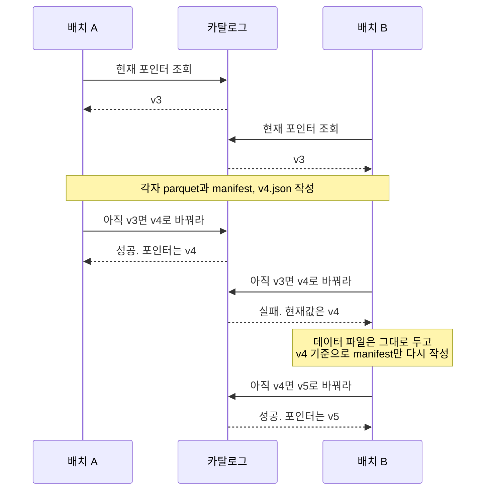
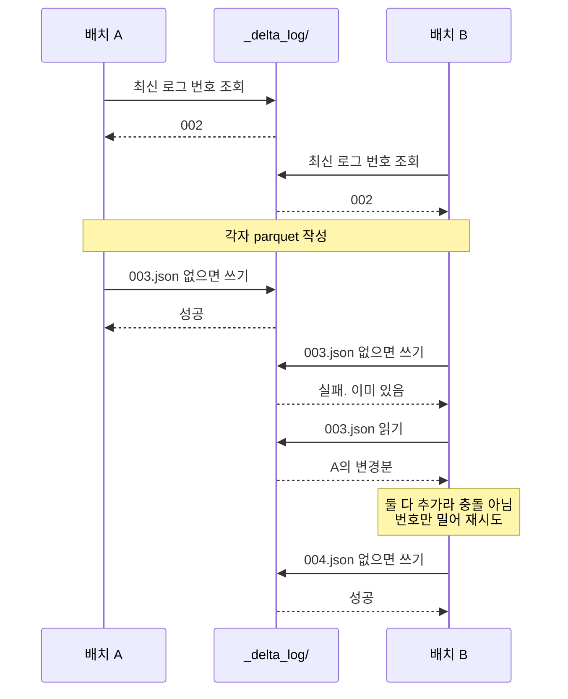
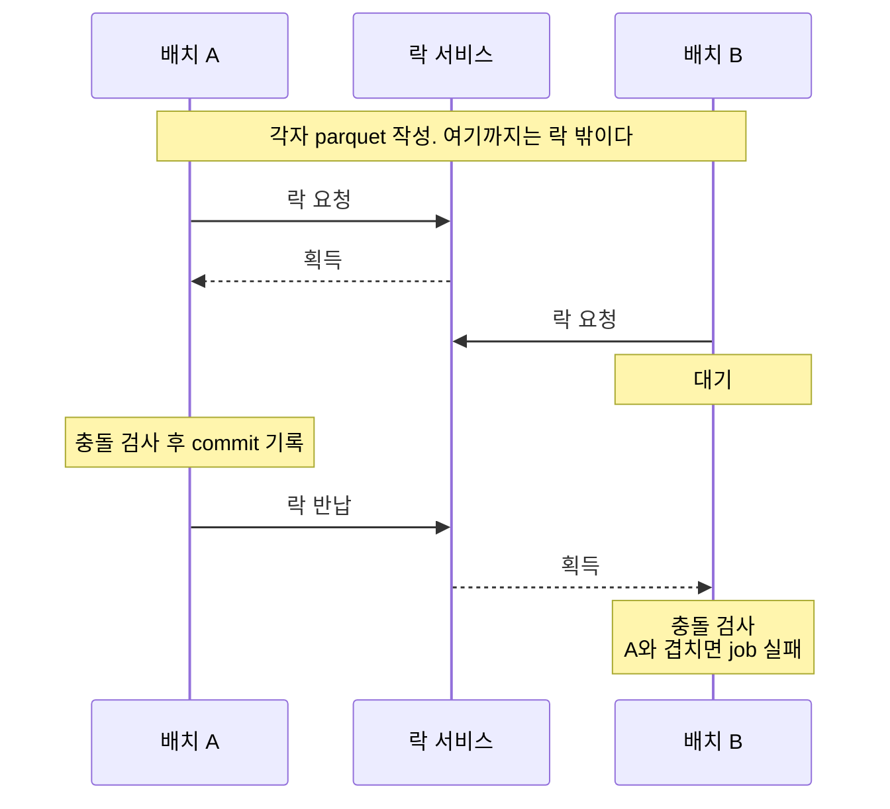

---
tags:
  - data_engineering
  - architecture
  - Data
  - database
  - distributed-system
created: 2026-08-05T00:00:00
updated: 2026-09-18T20:53:36
permalink: /Dev/database/open-table-formats-iceberg-vs-delta-lake-vs-hudi
---

> [!abstract]+ TL;DR
> - 세 포맷 모두 객체 스토리지의 Parquet 파일 묶음에 ACID·time travel·스키마 진화를 제공하는 메타데이터 레이어
> - 갈리는 지점은 커밋 원자성의 위치(Iceberg는 카탈로그, Delta는 로그 파일, Hudi는 타임라인+락)와 업데이트 처리 방식
> - 선택 기준은 벤치마크가 아니라 엔진 구성과 워크로드 성격, 카탈로그 전략

> *AI-assisted*

---

### 1. 왜 테이블 포맷이 필요했나

객체 스토리지에 Parquet 파일을 쌓아두면 저장은 싸지만 파일 묶음만으로는 현재 테이블 상태를 기록하지 못한다.
Hive 시절의 [[From Bulk Load to Data Lake#3. Hive가 디렉터리를 테이블이라고 불렀다|테이블 정의가 "이 디렉터리 아래 있는 파일 전부"]]였던 탓에 여러 문제가 따라왔다.

- **원자성 없음**: 쓰기 도중에 읽으면 절반만 반영된 상태가 보인다
- **파일 목록 스캔 비용**: 파티션이 수만 개면 `LIST` 호출만으로 query planning이 수 분 걸린다
- **스키마 변경 불가**: 컬럼 이름을 바꾸려면 전체를 다시 쓴다
- **파티션 결합도**: 파티션 컬럼을 쿼리에 명시하지 않으면 전체 스캔이 된다
- **롤백 불가**: 잘못 쓴 배치를 되돌릴 방법이 없다

> [!note]+ LIST 호출: 객체 스토리지의 목록 조회 API
> - S3의 `ListObjectsV2`, GCS의 `objects.list`처럼 접두사에 해당하는 키를 나열하는 요청
> - 객체 스토리지에는 디렉터리가 실재하지 않고 `dt=2024-01-01/part-0.parquet` 같은 키가 평면으로 늘어서 있을 뿐이라 파일 목록을 알려면 매번 요청이 필요
> - 한 번에 1,000개까지만 반환하므로 파일 10만 개면 왕복 100회. 호출당 수십~수백 ms가 붙고 단가도 GET보다 높다
> - Hive는 쿼리를 계획할 때마다 대상 파티션 경로를 전부 LIST했다. 파티션이 늘면 쿼리가 시작되기도 전에 대기 시간이 같이 늘어난다

세 포맷 모두 데이터 파일은 그대로 두고 어느 시점에 어떤 파일이 테이블에 속하는지를 메타데이터로 따로 기록한다.

```text
쿼리 엔진 (Spark / Flink / Trino / Snowflake)
        ↓
테이블 포맷 메타데이터  ← Iceberg / Delta Lake / Hudi
        ↓
파일 포맷 (Parquet / ORC / Avro)
        ↓
스토리지 (S3 / GCS / ADLS / HDFS)
```

> [!note]+ 테이블 포맷: 파일 포맷과 다른 계층
> - **파일 포맷**: 바이트를 어떻게 배치할지. [[Storage File Formats - Parquet vs ORC vs Avro|Parquet, ORC, Avro]]
> - **테이블 포맷**: 그 파일을 묶어 테이블로 만드는 규약. [Iceberg](https://iceberg.apache.org/spec/), [Delta](https://github.com/delta-io/delta/blob/master/PROTOCOL.md), [Hudi](https://hudi.apache.org/tech-specs/)
> 	- 테이블 포맷은 새 파일 형식을 만들지 않는다. 대부분 Parquet을 그대로 쓴다

---

### 2. 세 포맷의 출신과 설계 동기

같은 문제를 풀었지만 출발점이 달랐고 그 차이가 지금까지 설계에 남아 있다.

| 구분 | Apache Iceberg | Delta Lake | Apache Hudi |
|---|---|---|---|
| 출신 | Netflix, 2017 | Databricks, 2019 | Uber, 2016 |
| 재단 | Apache | Linux Foundation | Apache |
| 최초 동기 | 페타바이트 테이블의 query planning 지연 | Spark 파이프라인의 신뢰성 | CDC 데이터의 레코드 단위 갱신 |
| 설계 중심 | 스캔 효율과 엔진 중립성 | 단순함과 Spark 통합 | ingestion 지연과 upsert 처리량 |

- **Iceberg**: Hive 테이블이 수십만 파티션에 도달하면서 메타스토어가 병목이 되자 파일 목록과 통계를 메타데이터 파일에 미리 저장해 `LIST` 호출 자체를 없앴다
- **Delta**: Spark job이 중간에 실패하면 부분 출력이 남는 문제에서 출발했다. 로그는 단순하게 유지하고 Spark와의 결합을 우선했다
- **Hudi**: Uber의 트립 데이터가 계속 갱신되는 상황이 배경이라 레코드 키로 파일을 찾는 인덱스를 처음부터 넣었다

> [!tip]+ 비유: 세 포맷은 서로 다른 도서관 관리법이다
> - **Iceberg**: 사서가 목록 카드를 계층으로 관리한다. 어느 책이 어느 서가에 있고 페이지 범위가 얼마인지까지 카드에 적혀 있어 서가를 돌 필요가 없다
> - **Delta**: 입출고 장부를 시간순으로 적는다. 현재 재고를 알려면 장부를 처음부터 읽어 내려간다. 대신 주기적으로 재고 스냅샷을 남긴다
> - **Hudi**: 책마다 고유 번호를 붙이고 색인을 유지한다. 같은 번호의 개정판이 들어오면 색인으로 원본을 찾아 바로 교체한다

---

### 3. 메타데이터 구조

세 포맷은 테이블의 현재 상태를 서로 다른 메타데이터 구조로 기록한다.

- **Iceberg**: manifest 트리
- **Delta Lake**: 트랜잭션 로그
- **Hudi**: 타임라인과 파일 그룹

메타데이터를 스토리지에 파일로 쌓는다는 점은 셋이 같다. 최신 상태를 확인하는 위치는 포맷마다 다르다.

#### 3.1 Iceberg: manifest 트리

```text
카탈로그 (Hive Metastore / Glue / REST ...)
└─ analytics.orders ─→ s3://lake/db/orders/metadata/00002-def.metadata.json
                       현재 스냅샷 포인터. 커밋마다 이 값이 바뀐다

s3://lake/db/orders/
├─ metadata/
│  ├─ 00001-abc.metadata.json      이전 버전
│  ├─ 00002-def.metadata.json      ← 카탈로그가 가리키는 현재 버전
│  │                               스키마, 파티션 스펙, 정렬 순서, 스냅샷 목록
│  ├─ snap-8901-1-xyz.avro         manifest list: manifest file 목록 + 파티션 범위
│  └─ xyz-m0.avro                  manifest file: 데이터 파일 목록 + 컬럼 통계
└─ data/
   └─ dt=2026-08-05/
      └─ 00000-0-abc.parquet
```

- **3단 트리**: `metadata.json` → manifest list → manifest file 순으로 내려간다. 상위 노드에 하위 범위 요약이 들어 있어 위에서부터 가지치기가 된다
- **파일별 통계**: 컬럼마다 min/max, null 개수, 값 개수를 manifest에 저장한다. `WHERE amount > 1000`에서 파일의 max가 1000 이하이면 통계만 보고 그 파일을 건너뛴다
- **불변**: 커밋할 때마다 새 `metadata.json`을 쓴다. 기존 파일은 수정하지 않는다
- **카탈로그가 필수**: `metadata/`에 여러 버전이 쌓여 있어도 파일 목록만으로는 어느 것이 현재인지 알 수 없다. 커밋에 실패해 버려진 파일도 섞여 있다

#### 3.2 Delta Lake: 트랜잭션 로그

```text
s3://lake/orders/
├─ _delta_log/
│  ├─ 00000000000000000000.json                 Action 목록
│  ├─ 00000000000000000001.json
│  ├─ ...
│  ├─ 00000000000000000010.checkpoint.parquet   10커밋마다 전체 상태
│  └─ _last_checkpoint                          최신 체크포인트 위치
└─ part-00000-....snappy.parquet
```

각 JSON은 상태 전체가 아니라 **변경분**을 담는다.

```jsonl
{"add":{"path":"part-00003-....parquet","partitionValues":{},"size":1048576,"modificationTime":1754000000000,"dataChange":true,"stats":"{\"numRecords\":5000,\"minValues\":{\"id\":1}}"}}
{"remove":{"path":"part-00001-....parquet","deletionTimestamp":1754000000000,"dataChange":true}}
```

- **현재 상태 = 체크포인트 + 이후 JSON 재생**: 로그를 순서대로 적용해 파일 목록을 만든다
- **경로로 최신 상태 확인**: `_delta_log/`를 나열해 번호가 가장 큰 JSON을 찾으면 최신 커밋이다. 카탈로그 없이 경로만으로 읽힌다
- **구조가 얕다**: 트리를 타지 않는다. 커밋이 많이 쌓이면 로그 재생 비용이 생긴다

#### 3.3 Hudi: 타임라인과 파일 그룹

```text
s3://lake/orders/
├─ .hoodie/
│  ├─ hoodie.properties
│  ├─ 20260805120000.commit                타임라인 instant
│  ├─ 20260805121500.deltacommit
│  ├─ 20260805130000.compaction.requested
│  └─ metadata/                            메타데이터 테이블 (그 자체가 Hudi 테이블)
└─ 2026/08/05/
   ├─ fileId-1_20260805120000.parquet      base file
   └─ .fileId-1_20260805121500.log.1       log file (MOR)
```

- **타임라인**: 모든 동작이 instant로 기록된다. 상태는 `requested` → `inflight` → `completed`로 진행한다. 타임스탬프가 가장 큰 완료 instant가 현재 상태라 카탈로그 없이 읽힌다
- **파일 그룹**: 레코드 키가 특정 파일 그룹에 고정 매핑된다. 같은 키의 갱신은 항상 같은 그룹으로 간다
- **메타데이터 테이블**: 파일 목록, 컬럼 통계, 레코드 인덱스를 별도 내부 테이블로 관리한다

> [!note]+ File Group과 File Slice: Hudi 고유 개념
> - **File Group**: 같은 `fileId`를 공유하는 파일 묶음. 레코드 키의 소속 단위
> - **File Slice**: 하나의 base file + 그에 딸린 log file. 커밋 시점마다 새 file slice가 생긴다
> - 이 구조에서 "이 키를 갱신하려면 어느 파일을 건드려야 하는지"가 정해진다

> [!note]+ 카탈로그: 포맷별 역할
> - **Iceberg**: 현재 스냅샷 포인터를 카탈로그가 들고 있다. 카탈로그 접속 정보 없이는 테이블을 열 수 없다
> - **Delta·Hudi**: 현재 상태 정보가 스토리지에 있다. 카탈로그는 이름과 권한을 붙이는 용도라 지워도 경로로 다시 읽힌다
> - Delta·Hudi도 이름으로 참조하고 테이블 단위로 권한을 걸고 Athena·Trino가 테이블을 찾게 하려면 카탈로그에 등록해야 한다

---

### 4. 커밋과 동시성 (원자성을 누가 보장하는가)

#### 4.1 같은 상황을 셋에 놓고 본다

배치 두 개가 같은 테이블에 동시에 쓰는 상황을 가정한다.

- **09:00 배치 A**: 어제 주문 1만 건을 orders 테이블에 추가
- **09:00 배치 B**: 누락분 재처리. 같은 테이블에 5천 건 추가
- **공통 시작점**: 둘 다 09:00 시점의 테이블 상태를 읽고 각자 일을 시작했다

세 포맷은 다음 절차로 데이터를 추가한다.

1. 현재 테이블 상태를 읽는다
2. 각자 Parquet 데이터 파일을 스토리지에 쓴다. 이 단계는 독립적으로 실행된다
3. _마지막에 새 데이터 파일을 테이블 메타데이터에 기록한다_

차이는 3번에서 생긴다. 세 포맷은 커밋을 서로 다른 위치와 방식으로 처리한다.

> [!note]+ multi-writer: 한 테이블에 둘 이상이 동시에 쓰는 상황
> - 스트리밍 ingestion이 계속 쓰는 중에 배치 backfill이 같은 테이블에 들어올 때
> - compaction이나 cleanup job이 ingestion과 시간대가 겹칠 때
> - 팀이 여럿이라 서로 다른 클러스터에서 같은 테이블을 갱신할 때
> - writer가 하나뿐이면 아래의 커밋 경쟁은 일어나지 않는다. 다만 compaction 같은 table service는 별도 행위자라 그쪽 충돌은 남는다

> [!note]+ 셋 다 [[Concurrency Control - MVCC, OCC, and Locking|낙관적 동시성 제어]]를 쓴다
> - 각 writer가 작업한 뒤 커밋 직전에 다른 커밋과 충돌하는지 검사한다
> - 배치 job 사이의 충돌이 드물면 충돌로 다시 처리할 작업도 적다
> - Iceberg는 카탈로그의 포인터 교체, Delta는 로그 파일의 조건부 생성, Hudi의 OCC 모드는 커밋 락으로 마지막 기록을 조정한다

> [!note]+ 읽기 충돌은 이미 풀려 있다
> - 세 포맷 모두 데이터 파일을 덮어쓰지 않고 새로 쌓는다. 읽는 쪽은 자기가 잡은 스냅샷을 계속 본다
> - reader는 특정 버전을 계속 읽는다. 이후 설명은 writer ↔ writer에 집중한다
>
> | 포맷 | reader ↔ writer | writer ↔ writer |
> | --- | --- | --- |
> | Iceberg | 스냅샷 | 카탈로그 CAS |
> | Delta | 버전별 로그 | 로그 파일 이름 선점 |
> | Hudi | 타임라인 instant | OCC + 외부 lock provider |

#### 4.2 Iceberg: 카탈로그의 포인터를 바꾼다

카탈로그는 현재 `metadata.json`의 위치를 포인터로 저장한다. 커밋은 그 포인터를 바꾸는 일이다.



- **B의 Parquet 파일은 버리지 않는다**: 이미 스토리지에 쓴 데이터는 그대로 두고 manifest만 새 기준으로 다시 만든다. 그래서 재시도 비용이 낮다
- **커밋 원자성은 카탈로그가 조정한다**: 카탈로그가 현재 `metadata.json` 포인터의 교체를 조정한다
- **대신 카탈로그가 없으면 테이블이 성립하지 않는다**

> [!note]+ 커밋 검증: 포인터 비교와 충돌 판정
> - CAS는 포인터 값만 비교한다. 포인터는 테이블에 하나뿐이라 **다른 파티션에 append한 커밋에도 실패한다**
> - 그래서 재시도할 때 새 base를 읽고 그 커밋이 자기와 실제로 충돌하는지 한 번 더 판정한다. 둘 다 append면 충돌이 아니라 manifest만 다시 만들고 넘어간다
> - 이 판정 기준은 설정으로 정한다
>
> | 속성 | 기본값 | 허용 값/의미 |
> | --- | --- | --- |
> | `write.delete.isolation-level` | `serializable` | `serializable` 또는 `snapshot` |
> | `write.update.isolation-level` | `serializable` | 〃 |
> | `write.merge.isolation-level` | `serializable` | 〃 |
> | `commit.retry.num-retries` | `4` | 재시도 횟수 |
>
> - `serializable`은 내 필터에 맞는 파일이 그사이 추가됐으면 실패시키고 `snapshot`은 같은 파일이 지워졌을 때만 실패시킨다

> [!note]+ 카탈로그 CAS: metadata 포인터의 조건부 교체
> - Iceberg는 [[Concurrency Control - MVCC, OCC, and Locking#^57a45b|CAS]]로 현재 metadata 포인터가 writer가 읽었던 값과 같을 때만 새 metadata 파일을 가리키도록 교체한다

#### 4.3 Delta: 로그 파일 이름을 선점한다

`_delta_log/` 아래 번호가 매겨진 JSON을 쌓는 구조라 커밋은 다음 번호의 로그 파일을 생성하는 일이다.



- **충돌 검사가 한 단계 더 있다**: B는 자기가 읽은 뒤 들어온 003.json을 열어본다. 둘 다 append면 번호만 밀어 재시도한다. A가 지운 파일을 B도 지우려 했다면 실제 충돌이라 실패한다
- **카탈로그가 필요 없다**: 최신 커밋을 알려면 `_delta_log/`를 나열해 가장 큰 번호를 찾으면 된다

> [!note]+ PUT-if-absent: 없을 때만 써라
> - "이 이름의 파일이 아직 없으면 만든다. 이미 있으면 실패한다"를 쪼갤 수 없는 한 동작으로 처리한다
> - Unix의 `open(O_CREAT|O_EXCL)`과 HTTP의 [`If-None-Match: *`](https://developer.mozilla.org/ko/docs/Web/HTTP/Reference/Headers/If-None-Match)는 대상이 없을 때만 생성하는 조건을 지정하는 예다
> - CAS와 발상은 같고 비교 대상만 다르다. CAS는 값을 보고 이쪽은 존재 여부를 본다

> [!warning]+ 주의: S3 multi-writer Delta 테이블
> - 이 방식은 스토리지가 "없을 때만 쓰기"를 원자적으로 보장해야 성립한다
> - HDFS와 ADLS는 파일 시스템 수준의 원자적 동작을 제공해 문제가 없다. S3에는 오래도록 이 기능이 없어서 두 클러스터가 같은 `003.json`을 쓰면 이전 커밋 로그가 덮어써질 수 있었다
> - 그래서 `S3DynamoDBLogStore`로 DynamoDB에 락 테이블을 두는 구성이 필요했다
> - S3가 `If-None-Match` 조건부 쓰기를 지원하면서 제약이 풀렸지만 운영 중인 Delta 버전이 이를 쓰는지 확인이 필요하다
> - 단일 Spark 클러스터만 쓰는 경우에는 해당하지 않는다

> [!note]+ ADLS: Azure Data Lake Storage
> - Azure의 객체 스토리지 위에 계층적 네임스페이스를 얹은 것이라 디렉터리와 rename이 실재한다
> - **ADLS의 원자적 rename**: [계층적 네임스페이스](https://learn.microsoft.com/en-us/azure/storage/blobs/data-lake-storage-namespace)를 사용하는 ADLS에서는 같은 파일 시스템 안의 rename을 원자적으로 처리한다. 임시 경로에 파일을 다 쓴 뒤 최종 경로로 rename해 공개한다
> - S3에는 rename이 없다. 복사 후 삭제라 파일 수만큼 비용이 붙고 중간에 실패하면 부분 완료 상태가 남는다
> - HDFS도 원자적 rename을 제공한다

#### 4.4 Hudi: 데이터 파일은 락 밖에서 쓰고 커밋만 락 안에서 처리한다

기본 가정이 단일 writer다. 다만 **단일 writer 모드에서도 동시성 제어는 이미 돌고 있다.** ingestion writer와 별도로 compaction·clustering·cleaning 같은 table service가 같은 테이블을 건드리기 때문이다.

reader는 읽기 시작 시점의 파일 버전을 참조하고 writer는 새 버전을 쓴다. 같은 프로세스의 writer와 async table service를 락으로 조정할 때는 [`InProcessLockProvider`](https://hudi.apache.org/docs/concurrency_control/)를 사용할 수 있다.

| 부딪히는 조합 | 해결 수단 | 락 |
| --- | --- | --- |
| writer ↔ reader | 버전 | 불필요 |
| writer ↔ 같은 프로세스의 async table service | 버전 + 프로세스 내부 조정 | 필요 시 `InProcessLockProvider` |
| **writer ↔ writer** (OCC 모드) | OCC | **공유 락 필요** |

**여러 writer를 OCC 모드로 실행할 때는 writer 사이에서 공유할 락을 지정한다.**



```properties
# 기본값. writer가 하나면 이대로 둔다
hoodie.write.concurrency.mode=SINGLE_WRITER

# writer가 둘 이상이면 OCC로 바꾸고 락을 지정한다
hoodie.write.concurrency.mode=optimistic_concurrency_control
hoodie.write.lock.provider=org.apache.hudi.aws.transaction.lock.DynamoDBBasedLockProvider
hoodie.cleaner.policy.failed.writes=LAZY
```

마지막 줄이 함께 필요하다. 기본값 `EAGER`는 다른 writer가 아직 쓰는 중인 파일을 실패한 것으로 보고 지운다.

- **락 구간이 짧다**: 데이터 파일 쓰기는 락 밖에서 한다. 커밋 직전 충돌 검사와 기록만 락 안이다
- **자동 재시도를 하지 않는다**: Iceberg와 Delta는 실패한 커밋을 새 기준으로 다시 시도하지만 Hudi는 기본적으로 job을 실패시킨다. 재실행은 파이프라인에서 처리해야 한다
- **비차단 동시성 제어**: Hudi 1.x는 로그 파일 기반의 비차단 동시성 제어를 추가해 스트리밍 ingestion과 compaction이 서로를 막지 않게 했다

> [!note]+ lock provider: 락 구현 지정
> - 커밋 락에 사용할 구현을 지정하는 설정이다. 같은 프로세스 안의 락은 `InProcessLockProvider`로 조정할 수 있고 여러 writer 사이에서는 DynamoDB나 ZooKeeper 같은 공유 락 구현을 쓴다
> - DynamoDB, ZooKeeper, Hive Metastore, 파일 시스템 기반 중에 고른다
> - 락 서비스가 중단되면 커밋이 막히고 락을 해제하지 못한 채 job이 비정상 종료하면 만료를 기다려야 한다

> [!note]+ 단일 writer에도 lock provider가 나오는 경우
> - 한 프로세스가 쓰면서 async table service를 함께 실행하는 구성에서는 `InProcessLockProvider`를 사용할 수 있다
> - 같은 JVM 안에서만 도는 락이라 DynamoDB나 ZooKeeper가 필요 없다

#### 4.5 정리

| 포맷 | 원자성의 근거 | 실패한 쪽의 처리 | 필수 외부 구성 요소 |
|---|---|---|---|
| Iceberg | 카탈로그의 CAS | manifest만 다시 만들어 재시도 | 카탈로그 (필수) |
| Delta | 로그 파일 PUT-if-absent | 로그 번호를 밀어 재시도 | 없음. S3 multi-writer는 조건부 쓰기 또는 락 |
| Hudi | 타임라인 + 외부 락 | 기본은 job 실패 | multi-writer일 때 lock provider |

앞의 append 예시에서 Iceberg와 Delta는 충돌 검증을 통과하면 이미 쓴 데이터 파일을 재사용해 커밋을 다시 시도한다. 이 재시도는 메타데이터 갱신이 중심이다. Hudi의 job 실패 후 재실행 비용은 파이프라인의 재처리 범위에 따라 달라진다.

---

### 5. 카탈로그 전략

**Iceberg**는 카탈로그로 테이블을 조회하고 메타데이터 변경을 커밋한다. 카탈로그 구성에 쓰이는 API 규격, 구현체, 저장 서비스는 다음과 같이 구분한다.

| 항목 | 종류 | 설명 |
|---|---|---|
| Hive Metastore | 메타데이터 서비스 | 테이블과 스키마 등의 메타데이터 관리 |
| AWS Glue Data Catalog | 관리형 카탈로그 서비스 | AWS에서 제공하는 중앙 메타데이터 저장소 |
| [Iceberg REST Catalog API](https://iceberg.apache.org/rest-catalog-spec/) | 인터페이스 규격 | 엔진과 카탈로그 사이의 공통 HTTP API |
| Nessie | 카탈로그 구현 | 테이블 메타데이터의 브랜치와 커밋 관리 |
| [Polaris](https://polaris.apache.org/releases/1.4.0/) | 카탈로그 구현 | Iceberg REST Catalog API 구현 |
| [S3 Tables](https://docs.aws.amazon.com/AmazonS3/latest/userguide/s3-tables.html) | 관리형 테이블 스토리지 | Iceberg 테이블 저장과 유지보수 제공 |
| [HadoopCatalog](https://iceberg.apache.org/javadoc/latest/org/apache/iceberg/hadoop/HadoopCatalog.html) | 파일 시스템 기반 카탈로그 구현 | 디렉터리와 메타데이터 파일로 관리. 원자적 rename 필요 |

아래는 Spark를 REST Catalog API로 Polaris에 연결하는 설정이다.

```python
spark.conf.set("spark.sql.catalog.prod", "org.apache.iceberg.spark.SparkCatalog")
spark.conf.set("spark.sql.catalog.prod.type", "rest")
spark.conf.set("spark.sql.catalog.prod.uri", "https://polaris.example.com/api/catalog")
```

**Delta**와 **Hudi**는 경로 기반으로 동작한다. 카탈로그 등록은 이름 붙이기와 권한 관리 용도이고 커밋 원자성과는 무관하다.

```python
# 카탈로그 등록 없이 읽힌다
spark.read.format("delta").load("s3://lake/orders")
spark.read.format("hudi").load("s3://lake/orders")
```

- **테이블 이름과 경로 변경**: Iceberg의 테이블 이름은 카탈로그에서 바꾸며 데이터 파일은 이동하지 않는다. 경로 기반으로 읽는 테이블의 디렉터리를 옮길 때는 읽기 경로와 카탈로그 등록 정보도 함께 확인한다
- **파일 위치의 자유도**: Iceberg manifest는 절대 경로를 기록해 한 테이블의 파일이 여러 버킷에 흩어져도 된다. Delta와 Hudi를 경로 기반으로 읽을 때는 테이블의 루트 경로를 지정한다
- **초기 진입 비용**: Delta와 Hudi는 카탈로그를 별도로 구축·운영하지 않고 시작한다

> [!info]+ 주의: 카탈로그 교체 시 권한과 job 설정 변경
> - 카탈로그를 바꾸면 테이블 재등록, 권한 재설계, 모든 job의 커넥터 설정 변경이 필요하다
> - 초기 설계 단계에서 카탈로그와 권한·커넥터 구성을 함께 검토한다

---

### 6. 파티션, 데이터 배치와 Data Skipping

읽을 데이터를 줄이는 기법은 역할에 따라 구분한다.

| 역할 | 동작 |
|---|---|
| 파티셔닝 | 데이터를 파티션으로 나누고 조회 조건에 맞는 파티션만 선택 |
| 데이터 배치 | 정렬·Z-Ordering·clustering으로 관련 레코드를 같은 파일에 모음 |
| 통계 기반 Data Skipping | 조회 조건과 파일별 min/max 등을 비교해 불필요한 파일 제외 |

정렬 등으로 파일별 값 범위를 좁히면 조회 조건과 겹치지 않는 파일을 제외하기 쉬워진다.

세 포맷 모두 파일별 컬럼 통계를 활용한 data skipping을 지원하며 통계를 관리하는 메타데이터가 다르다.

| 포맷 | 파일별 컬럼 통계의 관리 위치 |
|---|---|
| [Iceberg](https://iceberg.apache.org/docs/latest/performance/) | manifest의 데이터 파일 항목 |
| [Delta](https://docs.delta.io/optimizations-oss/) | 트랜잭션 로그의 파일 메타데이터 (`add.stats`) |
| [Hudi](https://hudi.apache.org/docs/metadata/) | 메타데이터 테이블의 `column_stats` |

> [!note]+ 구현 예: Hidden Partitioning과 데이터 배치
> - **Hidden Partitioning**([Iceberg](https://iceberg.apache.org/docs/latest/partitioning/)): 원본 컬럼의 조회 조건을 파티션 조건으로 변환한다. 예를 들어 `ts` 조건으로 `days(ts)` 파티션을 고른다
> - **Z-Ordering**: 여러 컬럼의 가까운 값을 같은 파일에 모으는 배치 기법이다. Delta와 [Iceberg](https://iceberg.apache.org/docs/latest/spark-procedures/), [Hudi](https://hudi.apache.org/docs/procedures/)의 지원 엔진에서 사용할 수 있다
> - **Liquid Clustering**([Delta](https://docs.delta.io/delta-clustering/)): 지정한 키로 `OPTIMIZE`가 필요한 파일을 점진적으로 재배치한다. 키 변경과 기존 파일 재배치는 별도 작업이며 파티셔닝·Z-Ordering과 함께 사용할 수 없다

```sql
-- Iceberg: Hidden Partitioning (Spark SQL)
CREATE TABLE orders_iceberg (order_id BIGINT, ts TIMESTAMP)
USING iceberg
PARTITIONED BY (days(ts));

-- 원본 컬럼의 조건으로 파티션을 선택한다
SELECT * FROM orders_iceberg
WHERE ts >= TIMESTAMP '2026-08-01 00:00:00';
```

```sql
-- Delta: 기존 테이블에 Z-Ordering 적용
OPTIMIZE orders ZORDER BY (customer_id, ts);
```

```sql
-- Delta: Liquid Clustering 테이블 생성
CREATE TABLE orders_clustered (customer_id BIGINT, ts TIMESTAMP)
USING DELTA
CLUSTER BY (customer_id, ts);
```

---

### 7. 업데이트와 삭제 처리

업데이트와 삭제는 레이크하우스에서 비용이 큰 연산이라 세 포맷의 처리 방식이 갈린다.

#### 7.1 기본 전략
1. Copy-on-Write (COW)
	- 그 행이 든 파일을 통째로 다시 씀
	- 쓰기 비쌈 / 읽기 빠름
2. Merge-on-Read (MOR)
	- 변경분만 따로 기록, 읽을 때 병햡
	- 쓰기 빠름 / 읽기 비쌈

#### 7.2 포맷별 구현

| | COW | MOR 방식 |
|---|---|---|
| Iceberg | 기본 | position delete / equality delete 파일. v3 스펙에서 deletion vector 도입 |
| Delta | 기본 | Deletion Vector. 삭제된 행 위치를 비트맵으로 표시 |
| Hudi | 테이블 타입으로 선택 | 테이블 타입으로 선택. base file + Avro log file |

- **Iceberg**: 삭제를 별도 파일로 기록한다. 위치 기반과 값 기반 두 가지가 있고 값 기반은 유연하지만 읽기 비용이 크다
- **Delta**: Deletion Vector로 파일 재작성을 피한다. 한 행을 지우려고 1GB 파일을 다시 쓰는 상황을 막는다
- **Hudi**: 테이블을 만들 때 COW/MOR을 정한다. MOR 테이블은 쿼리 타입도 나뉜다

> [!note]+ Hudi MOR의 세 가지 쿼리 타입
> - **Snapshot**: base + log를 병합해 최신 상태를 본다. log 병합 비용이 붙는다
> - **Read Optimized**: base file만 읽어 log 병합 비용은 줄지만 마지막 compaction 시점까지의 데이터만 본다
> - **Incremental**: 특정 커밋 이후 변경된 레코드만 읽는다

#### 7.3 upsert 성능 차이

upsert에서는 대상 파일을 찾는 방식이 성능 차이를 만든다.

```text
Iceberg / Delta의 MERGE
  → 대상 파일을 찾기 위해 소스와 타깃을 조인
  → 통계로 좁히지만 키가 넓게 퍼져 있으면 많은 파일을 건드림

Hudi의 upsert
  → 인덱스로 입력 레코드 키에 해당하는 파일 그룹 탐색
  → 그 파일 그룹에만 쓰기
```

Hudi의 [인덱스](https://hudi.apache.org/docs/next/indexes/)는 upsert할 레코드의 키로 대상 파일 그룹을 찾는다.

| 인덱스 | 파일 그룹을 찾는 방식 |
|---|---|
| Bloom | 레코드 키의 Bloom filter로 후보 파일을 좁힘 |
| Simple | 입력 레코드 키와 기존 데이터의 키를 조인해 위치를 찾음 |
| Bucket | 레코드 키의 해시로 파일 그룹을 결정 |
| Record Level Index | 메타데이터 테이블에 레코드 키→파일 그룹 매핑 저장 |

---

### 8. 스키마 진화

세 포맷 모두 [[Schema Evolution in Data Lakes|스키마 진화]]를 지원하지만 설정 없이 되는 범위가 다르다.

- **Iceberg**: 컬럼마다 고유 ID를 부여한다. 이름이 아니라 ID로 매핑하므로 이름을 바꾸거나 순서를 옮겨도 과거 데이터가 그대로 읽힌다. 추가·삭제·rename·순서 변경·타입 승격이 설정 없이 된다
- **Delta**: Column Mapping을 켜면 Iceberg와 같은 방식으로 동작한다. 끄고 쓰면 삭제와 rename이 막힌다
- **Hudi**: `schema.on.read`를 켜야 삭제와 rename이 된다

---

### 9. Time Travel과 증분 읽기

**Time travel**은 셋 다 지원한다. 포맷별 조회 문법은 다음과 같다.

```sql
-- Iceberg
SELECT * FROM orders FOR SYSTEM_TIME AS OF '2026-08-01 00:00:00';
SELECT * FROM orders FOR SYSTEM_VERSION AS OF 3821550127947089987;

-- Delta
SELECT * FROM orders TIMESTAMP AS OF '2026-08-01';
SELECT * FROM orders VERSION AS OF 12;

-- Hudi
SELECT * FROM orders TIMESTAMP AS OF '20260801000000';
```

Hudi의 **증분 읽기**는 지정한 커밋 이후 변경된 레코드를 조회한다.

```python
# Hudi: 특정 instant 이후 변경된 레코드만
spark.read.format("hudi") \
    .option("hoodie.datasource.query.type", "incremental") \
    .option("hoodie.datasource.read.begin.instanttime", "20260801120000") \
    .load("s3://lake/orders")
```

```python
# Delta: Change Data Feed (테이블 속성으로 켜야 함)
spark.read.format("delta") \
    .option("readChangeFeed", "true") \
    .option("startingVersion", 12) \
    .table("orders")
```

```sql
-- Iceberg: incremental scan / changelog view
SELECT * FROM analytics.orders.changes
WHERE _change_ordinal >= 3;
```

- **Hudi**: ingestion 파이프라인 설계 자체가 증분 소비를 전제로 한다
- **Delta**: CDF를 명시적으로 켜야 하고 켠 시점 이후부터 기록된다
- **Iceberg**: 스냅샷 간 차이를 계산하는 방식이라 삭제 처리에 제약이 있다

---

### 10. 테이블 유지보수

작은 파일을 병합하고 오래된 데이터를 정리하는 작업이 필요하다.

| 작업 목적 | Iceberg | Delta | Hudi |
|---|---|---|---|
| 작은 파일 병합·데이터 재배치 | `rewrite_data_files` | `OPTIMIZE` | clustering |
| MOR의 base file과 log file 병합 | 해당 없음 | 해당 없음 | compaction |
| 오래된 데이터 정리 | `expire_snapshots`: 스냅샷 만료와 불필요해진 파일 삭제 | `VACUUM`: 보관 기간이 지난 미사용 데이터 파일 삭제 | Cleaner: 보관 정책에 따른 과거 파일 버전 삭제 |

실행 주기와 자동화 여부는 엔진·관리형 서비스·설정에 따라 달라진다.

```sql
-- Iceberg
CALL catalog.system.rewrite_data_files(table => 'analytics.orders');
CALL catalog.system.expire_snapshots(table => 'analytics.orders', older_than => TIMESTAMP '2026-07-01');

-- Delta
OPTIMIZE orders;
VACUUM orders RETAIN 168 HOURS;
```

> [!warning]+ 주의: 데이터 보관 기간
> - 오래된 파일을 삭제하면 그 파일이 필요한 time travel이나 장기 쿼리가 실패할 수 있다
> - 보관 기간은 필요한 롤백 범위와 장기 쿼리 실행 시간을 고려해 정한다

---

### 11. 생태계가 수렴하는 지점

서로 다른 포맷의 메타데이터를 생성하거나 변환해 같은 데이터 파일을 읽는 상호운용 기능이 제공된다.

- **Delta UniForm**: 하나의 Parquet 데이터에 `_delta_log`와 Iceberg 메타데이터를 함께 생성한다. 엔진별로 골라 읽는다
- **Apache XTable**([구 OneTable](https://xtable.apache.org/)): 세 포맷의 메타데이터를 상호 변환한다. 데이터 파일은 그대로 두고 메타데이터만 만들어낸다
- **Unity Catalog의 Iceberg REST 엔드포인트**: Delta 테이블을 외부 엔진이 Iceberg REST로 읽게 열었다

권한과 lineage, 거버넌스를 관리할 카탈로그도 함께 선택한다.

---

### 12. 선택 기준

**Iceberg를 고른다**

- **엔진 혼용**: 여러 엔진을 섞어 쓰거나 앞으로 바꿀 가능성이 있다
- **웨어하우스 연동**: Snowflake, BigQuery, Trino 등 웨어하우스와 레이크를 함께 쓴다
- **AWS 스택**: AWS 네이티브 스택을 쓴다. S3 Tables와 Glue가 Iceberg를 우선한다
- **파티션 규모**: 파티션이 수만 개 이상이고 query planning이 병목이다
- **벤더 종속 회피**: 벤더 종속을 피하는 것이 조직 방침이다

**Delta Lake를 고른다**

- **Databricks 사용**: Databricks를 쓰고 있다
- **단일 엔진**: Spark 단일 엔진이고 팀 규모가 크지 않다
- **초기 진입 비용**: 카탈로그 인프라 없이 바로 시작하고 싶다
- **권한 관리**: Unity Catalog로 테이블·모델·노트북 권한을 한 곳에서 보고 싶다

**Hudi를 고른다**

- **고빈도 CDC**: 초 단위 또는 분 단위 CDC를 레이크에 반영해야 한다
- **upsert 병목**: 레코드 단위 upsert 처리량이 이미 병목이다
- **Flink 중심 파이프라인**: Flink 스트리밍 ingestion이 파이프라인의 중심이다
- **튜닝 여력**: 튜닝에 시간을 쓸 수 있는 데이터 엔지니어가 있다
