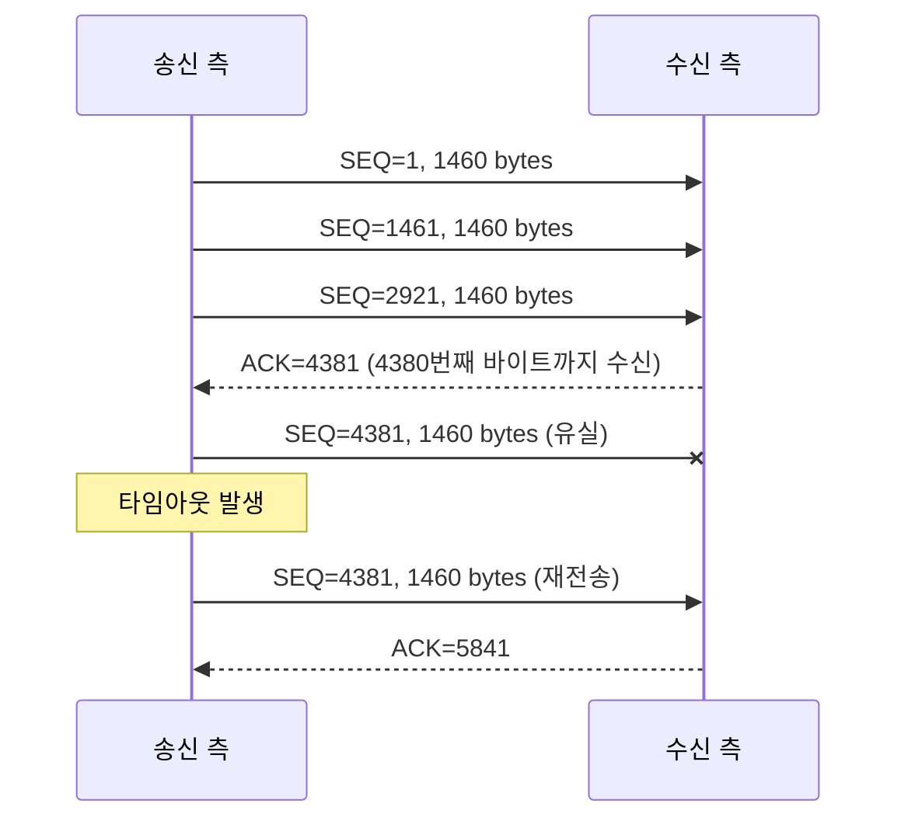
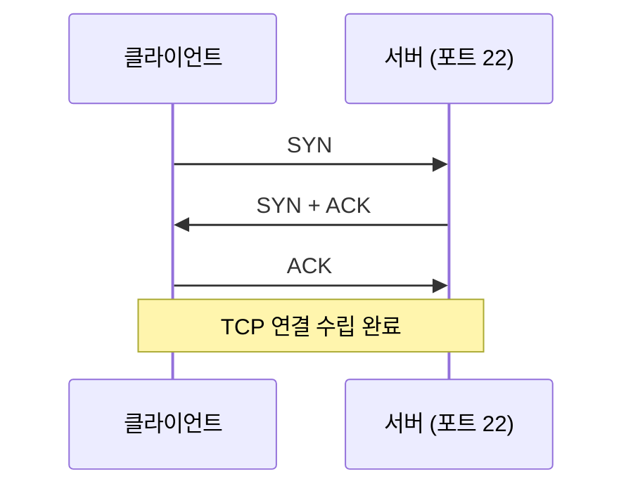
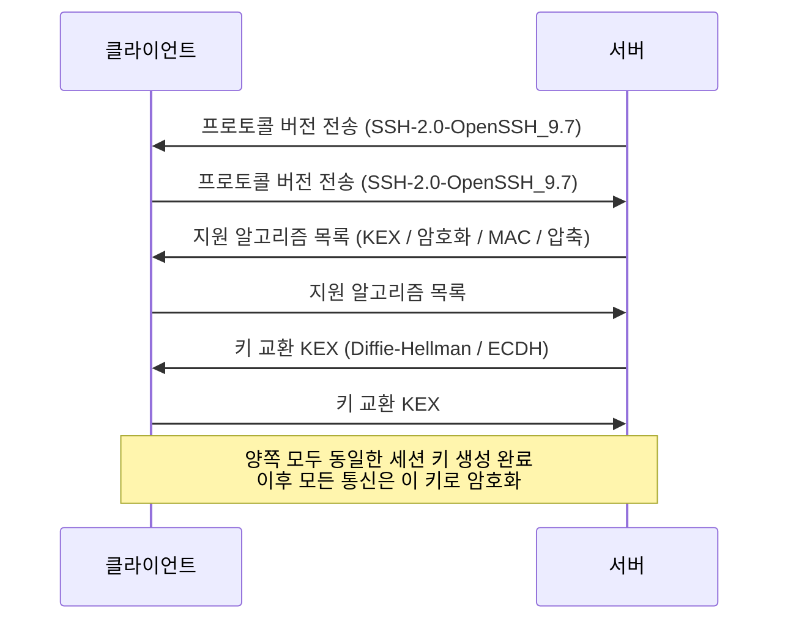
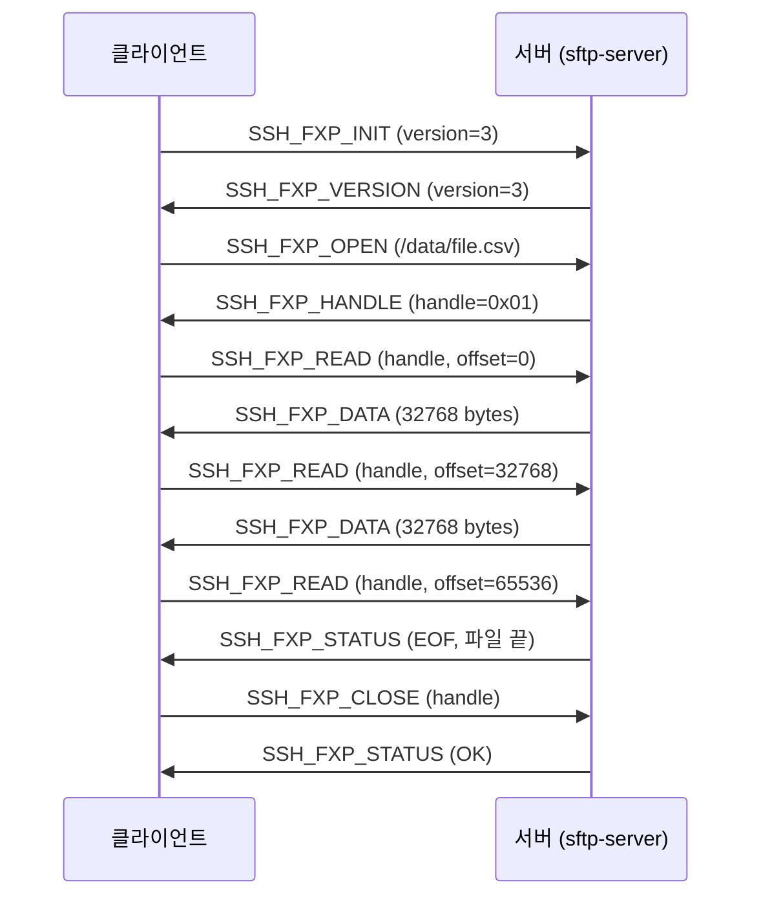

---
tags:
  - network
  - SSH
  - linux
  - security
created: 2026-06-30T00:00:00
updated: 2026-06-30T22:44:10
permalink: /Dev/network/scp-and-sftp-file-transfer-over-ssh
---
> [!warning]+ Alert
> 이 글은 Claude Code의 도움을 받아 작성되었습니다

> [!abstract]+ TL;DR
> - SCP와 SFTP는 SSH 위에서 동작하는 파일 전송 프로토콜
> - 파일 전송의 본질은 직렬화 → 패킷 분할 → 암호화 → 라우팅 → 재조립 과정
> - SCP는 단발성 복사에 특화, SFTP는 인터랙티브 파일 관리에 특화
> - OpenSSH 9.0부터 SCP 내부도 SFTP 프로토콜로 전환
> - 대안으로 rsync, rclone 등 상황에 맞는 도구 선택 필요

---
### 1. 파일 전송이란 무엇인가

서버 A에 있는 파일을 서버 B로 "보낸다"는 것은 물리적으로 파일이 이동하는 것이 아니다. **파일의 바이트 데이터를 네트워크를 통해 복제하는 것**이다. 이 과정을 이해하려면 몇 가지 핵심 개념을 먼저 알아야 한다.

##### 파일이란 무엇인가
운영체제 관점에서 파일은 **디스크에 저장된 연속된 바이트(byte) 시퀀스**다. `report.csv`든 `image.png`든 본질은 0과 1로 이루어진 바이트 배열이다.

```bash
# 파일의 바이트 구조 확인
xxd report.csv | head -5
# 00000000: 6e61 6d65 2c61 6765 2c63 6974 790a  name,age,city.
```

파일은 두 가지 정보로 구성된다.
- **메타데이터**: 파일명, 크기, 권한, 생성/수정 시각 (inode에 저장)
- **데이터**: 실제 내용 바이트

##### 직렬화 (Serialization)
파일을 네트워크로 전송하려면 먼저 **연속된 바이트 스트림으로 변환**해야 한다. 이것이 [[Python serialization#1. 직렬화란|직렬화]]다.

- 메모리에 올라간 파일 데이터를 순서가 보장된 바이트 시퀀스로 변환
- 수신 측에서 동일한 규칙으로 역직렬화(deserialization)하여 원본을 복원
- 파일 전송에서는 파일 내용 자체가 이미 바이트 시퀀스이므로, 메타데이터(파일명, 권한 등)를 함께 직렬화하는 것이 핵심

---
### 2. 네트워크를 통한 데이터 전달 — OSI 7계층과 TCP/IP

파일의 바이트가 네트워크를 타고 다른 서버에 도달하는 과정은 **계층화된 프로토콜 스택**을 거친다.

##### [[2. 네트워크 미시적으로 살펴보기#OSI 모델 (OSI 7계층, 이론적으로 기술한 '이상적 설계')|OSI 7계층 모델]]과 파일 전송의 관계

| OSI 계층          | 프로토콜 · 기술            | 파일 전송에서의 역할    |
| --------------- | -------------------- | -------------- |
| 7. Application  | SCP, SFTP, FTP, HTTP | 파일 전송 명령       |
| 6. Presentation | 데이터 형식 · 암호화         | SSH 암호화        |
| 5. Session      | SSH 세션 관리            | SSH 연결 수립      |
| 4. Transport    | TCP                  | 패킷 순서 보장 · 재전송 |
| 3. Network      | IP                   | 라우팅 · 목적지 결정   |
| 2. Data Link    | Ethernet, Wi-Fi      | 프레임 전송         |
| 1. Physical     | 전기 · 광 신호            | 물리적 전달         |

실무에서 더 많이 쓰는 **[[2. 네트워크 미시적으로 살펴보기|TCP/IP 4계층]]** 으로 보면 다음과 같다.

| TCP/IP 계층      | 역할                     | 파일 전송에서의 동작                               |
| -------------- | ---------------------- | ----------------------------------------- |
| Application    | 프로토콜 규약                | SCP/SFTP가 파일 데이터를 SSH 채널에 기록              |
| Transport      | 신뢰성 보장                 | [[11. TCP와 UDP\|TCP]]가 패킷 순서 보장, 유실 시 재전송 |
| Internet       | 주소 지정과 [[9. 라우팅\|라우팅]] | [[8. IP 주소\|IP]]가 목적지 서버까지의 경로를 결정        |
| Network Access | 물리적 전달                 | [[3. 이더넷\|이더넷]] 프레임으로 변환하여 실제 전송          |

##### 패킷 분할과 재조립

10MB 파일을 한 번에 보낼 수 없다. TCP는 데이터를 **세그먼트(segment)** 단위로 분할한다.

```text
Original file (10MB)
        │
        ▼
┌──────┬──────┬──────┬──────┬─────┐
│ seg1 │ seg2 │ seg3 │ seg4 │ ... │   TCP segments (MSS, ~1460 bytes)
└──┬───┴──┬───┴──┬───┴──┬───┴─────┘
   │      │      │      │
   ▼      ▼      ▼      ▼
┌──────┬──────┬──────┬──────┐
│ pkt1 │ pkt2 │ pkt3 │ pkt4 │         IP packets (MTU, ~1500 bytes)
└──────┴──────┴──────┴──────┘
   │      │      │      │
   ▼      ▼      ▼      ▼
   each packet is routed independently across the network
   │      │      │      │
   ▼      ▼      ▼      ▼
   reassembled by sequence number on the receiver
```

> [!info]+ MSS와 MTU
> - [[7. LAN을 넘어서는 네트워크 계층#IP의 기능 Addressing and Fragmentation|MTU]] (Maximum Transmission Unit): 네트워크 인터페이스가 한 번에 전송할 수 있는 최대 프레임 크기. 이더넷 기본값 1500 bytes
> - [[11. TCP와 UDP#MSS (maximum segment size) TCP로 전송할 수 있는 최대 페이로드 크기|MSS]] (Maximum Segment Size): TCP 세그먼트의 최대 데이터 크기. MTU에서 IP 헤더(20B)와 TCP 헤더(20B)를 빼면 `1500 - 40 = 1460 bytes`
> - 10MB 파일을 전송하면 약 7,200개의 패킷이 생성된다

##### TCP의 [[12. TCP의 오류•흐름•혼잡 제어|신뢰성 보장 메커니즘]]

파일 전송에서 TCP가 중요한 이유는 **데이터 무결성**을 보장하기 때문이다. 

- **순서 번호 (Sequence Number)**: 각 바이트에 고유 번호를 부여하여 수신 측에서 올바른 순서로 재조립
- **확인 응답 (ACK)**: 수신 측이 "여기까지 받았다"고 알려줌
- **재전송**: ACK가 일정 시간 내에 오지 않으면 해당 세그먼트를 다시 전송
- **체크섬 (Checksum)**: 전송 중 비트가 깨졌는지 검증
- **흐름 제어 (Flow Control)**: 수신 측의 버퍼 상태에 따라 전송 속도 조절 (Window Size)
- **혼잡 제어 (Congestion Control)**: 네트워크 혼잡도에 따라 전송량을 동적 조절



---
### 3. SSH — 보안 채널의 기반

SCP와 SFTP를 이해하려면 먼저 이들의 토대인 **[[방화벽과 원격 접속#SSH (Secure Shell)|SSH]]**(Secure Shell)를 알아야 한다.

##### SSH가 해결하는 문제
SSH 이전의 원격 접속 도구(Telnet, rsh)는 데이터를 **평문(plaintext)**으로 전송했다. 누군가 네트워크 중간에서 패킷을 가로채면(스니핑) 비밀번호와 전송 데이터가 그대로 노출되었다.

```text
[Telnet]
client ──── password: abc123  (plaintext) ────▶ server
                          │
                       (!) sniffer reads the password directly

[SSH]
client ──── 3f:a2:9b:...  (encrypted) ────▶ server
                          │
                       (!) sniffer only sees meaningless bytes
```

##### SSH 연결 수립 과정

SSH 연결은 세 단계로 이루어진다.

**1단계:  TCP 연결 수립 (3-way handshake)**



**2단계: SSH 키 교환과 암호화 협상**



> [!tip]+ Diffie-Hellman 키 교환의 핵심
> 두 당사자가 **비밀 키를 직접 전송하지 않고도** 동일한 공유 비밀(shared secret)을 만들어낸다. 비유하면 "두 사람이 각자 비밀 색을 섞어서 같은 최종 색을 만드는 것"과 같다. 네트워크를 도청해도 중간 값만으로는 최종 키를 계산할 수 없다.

**3단계: 사용자 인증**

```text
  client                                 server
  │                                            │
  │──── choose auth method ───────────────────▶│
  │                                            │
  ├─[ public-key auth ]────────────────────────┤
  │──── "authenticate with this public key" ──▶│
  │◀─── "that key is in authorized_keys" ──────│
  │──── data signed with the private key ─────▶│
  │◀─── authentication success ────────────────│
  │                                            │
  ├─[ password auth ]──────────────────────────┤
  │──── encrypted password ───────────────────▶│
  │◀─── authentication success ────────────────│
  │                                            │
```

##### SSH 채널 (Channel) 구조
하나의 SSH 연결 위에 **여러 논리 채널**을 열 수 있다. 이것이 SSH의 강점이다.

```text
┌──── SSH connection (single TCP connection) ──────────────────────────┐
│                                                                      │
│     ┌─────────────────┐   ┌─────────────────┐   ┌─────────────────┐  │
│     │ channel 0       │   │ channel 1       │   │ channel 2       │  │
│     │ shell session   │   │ SFTP subsystem  │   │ port forwarding │  │
│     └─────────────────┘   └─────────────────┘   └─────────────────┘  │
│                                                                      │
│  all channels are multiplexed into one encrypted TCP stream          │
└──────────────────────────────────────────────────────────────────────┘
```

각 채널은 흐름 제어와 데이터 전송이 독립적이다. SFTP는 이 채널 구조를 활용하여 SSH 연결 위에 **서브시스템**(subsystem)으로 동작한다.

---
### 4. SCP (Secure Copy Protocol)

##### 개념
SCP는 SSH 위에서 동작하는 **단방향 파일 복사** 프로토콜이다. BSD의 `rcp` (remote copy) 명령을 SSH로 감싼 것이 시초다.

##### 동작 원리

```
scp local.txt user@server:/home/user/

실행 흐름:
1. SSH 연결 수립 (위의 3단계)
2. 원격 서버에서 scp 프로세스 실행 (수신 모드)
3. 프로토콜 메시지로 파일 메타데이터 전송
4. 파일 데이터를 SSH 채널에 스트리밍
5. 전송 완료 후 연결 종료
```

SCP 프로토콜은 매우 단순한 텍스트 기반 명령을 사용한다.

```text
Sender -> Receiver:
  "C0644 1048576 local.txt\n"     # file mode, size, name
  [1048576 bytes of data]          # actual file content
  "\0"                             # transfer-complete signal

Receiver -> Sender:
  "\0"                             # OK response
```

- `C`: 일반 파일 전송 (디렉토리는 `D`)
- `0644`: 파일 퍼미션
- `1048576`: 파일 크기 (bytes)
- `local.txt`: 파일명

##### 기본 사용법

```bash
# 로컬 → 원격
scp file.txt user@host:/path/to/dest/

# 원격 → 로컬
scp user@host:/path/to/file.txt ./local/

# 디렉토리 재귀 복사
scp -r ./mydir user@host:/path/

# 포트 지정
scp -P 2222 file.txt user@host:/path/

# 대역폭 제한 (Kbit/s 단위)
scp -l 8000 bigfile.tar.gz user@host:/path/   # 1MB/s로 제한

# 압축 전송
scp -C largefile.log user@host:/path/

# 중간 서버 경유 (ProxyJump)
scp -J jumphost user@target:/path/file.txt ./
```

##### SCP의 한계
- **이어받기 불가**: 전송이 중단되면 처음부터 다시
- **디렉토리 탐색 불가**: 원격 파일 목록을 볼 수 없음
- **파일명 검증 미흡**: 과거 파일명 기반 보안 취약점이 발견됨 (CVE-2019-6111)
- **심볼릭 링크 처리 미흡**: 예상치 못한 파일 덮어쓰기 가능성

> [!info]+ SCP 프로토콜의 사실상 퇴출
> OpenSSH 8.0 (2019)부터 SCP의 보안 문제를 경고하기 시작했고 **OpenSSH 9.0** (2022)부터 `scp` 명령은 내부적으로 SFTP 프로토콜을 사용한다. 명령어 인터페이스는 동일하지만 전송 프로토콜이 바뀌었다.

---
### 5. SFTP (SSH File Transfer Protocol)

##### 개념
SFTP는 SSH 위에서 동작하는 **양방향 파일 관리** 프로토콜이다. 이름에 FTP가 들어가지만 **FTP와 전혀 다른 프로토콜**이다.

|         | FTP                                               | SFTP             |
| ------- | ------------------------------------------------- | ---------------- |
| 기반 프로토콜 | 자체 프로토콜                                           | SSH              |
| 포트      | 21 (제어) + 20 (데이터)                                | 22 (SSH 포트 하나)   |
| 암호화     | 없음 (FTPS는 [[SSL (Secure Sockets Layer)\|TLS]] 추가) | SSH에 의한 전체 암호화   |
| 방화벽     | 데이터 포트 동적 할당으로 까다로움                               | 단일 포트로 단순        |
| 설계 시기   | 1971년                                             | 2001년 (SSH-2 기반) |

##### 동작 원리

SFTP는 SSH 서브시스템으로 동작한다. SSH 연결이 수립된 후 그 위에 SFTP 채널을 연다.

```
1. SSH 연결 수립
2. 클라이언트 → 서버: "subsystem sftp" 요청
3. 서버: sftp-server 프로세스 실행
4. 이후 바이너리 패킷으로 요청/응답 교환
```

SFTP는 SCP와 달리 **구조화된 바이너리 패킷**을 사용한다.

```text
SFTP packet structure:
┌──────────┬──────┬────────┬──────────┐
│ length   │ type │ req_id │ payload  │
│ 4 bytes  │ 1 B  │ 4 B    │ variable │
└──────────┴──────┴────────┴──────────┘

주요 패킷 타입:
  SSH_FXP_INIT      (1)   - 초기화
  SSH_FXP_OPEN      (3)   - 파일 열기
  SSH_FXP_CLOSE     (4)   - 파일 닫기
  SSH_FXP_READ      (5)   - 파일 읽기
  SSH_FXP_WRITE     (6)   - 파일 쓰기
  SSH_FXP_STAT      (7)   - 파일 정보 조회
  SSH_FXP_OPENDIR   (11)  - 디렉토리 열기
  SSH_FXP_READDIR   (12)  - 디렉토리 읽기
  SSH_FXP_MKDIR     (14)  - 디렉토리 생성
  SSH_FXP_REMOVE    (13)  - 파일 삭제
  SSH_FXP_RENAME    (18)  - 이름 변경
```

##### 파일 다운로드 과정 상세



> [!tip]+ 왜 핸들(handle) 기반인가?
> SFTP는 일반 파일시스템 API와 유사하게 설계되었다. `open → read/write → close` 패턴은 POSIX 파일 I/O와 동일한 구조다. 이 덕분에 **임의 위치 읽기(seek)**, **이어받기**, **부분 업데이트**가 가능하다.

##### 기본 사용법 — 배치 모드

```bash
# 인터랙티브 접속
sftp user@host

# 접속 후 사용 가능한 명령
sftp> ls                          # 원격 파일 목록
sftp> lls                         # 로컬 파일 목록
sftp> cd /data                    # 원격 디렉토리 이동
sftp> lcd ~/downloads             # 로컬 디렉토리 이동
sftp> get remote_file.csv         # 다운로드
sftp> put local_file.csv          # 업로드
sftp> mget *.log                  # 다중 다운로드
sftp> mput *.csv                  # 다중 업로드
sftp> mkdir new_dir               # 원격 디렉토리 생성
sftp> rm old_file.txt             # 원격 파일 삭제
sftp> rename old.txt new.txt      # 이름 변경
sftp> df -h                       # 원격 디스크 용량 확인
sftp> !command                    # 로컬 셸 명령 실행
sftp> exit
```

```bash
# 비대화형 배치 모드
sftp -b batch.txt user@host

# batch.txt 내용:
# cd /data
# get report_2026.csv
# get summary.csv
# exit
```

```bash
# 이어받기 (중단된 전송 재개)
sftp> reget large_backup.tar.gz

# 포트 지정
sftp -P 2222 user@host
```

---
### 6. 전송 과정 전체 그림 — SCP로 파일을 보낼 때 실제로 일어나는 일

`scp report.csv user@10.0.1.50:/data/` 를 실행했을 때 일어나는 전체 과정을 바닥부터 추적한다.

```text
┌─ Client (10.0.1.10) ────────────────────────────────────────┐
│                                                             │
│  1. shell spawns the scp process                            │
│  2. scp calls the SSH library                               │
│                                                             │
│  ┌─ SSH layer ───────────────────────────────────────────┐  │
│  │ 3. TCP 3-way handshake -> 10.0.1.50:22                │  │
│  │ 4. SSH protocol version exchange                      │  │
│  │ 5. key exchange (ECDH) -> session key                 │  │
│  │ 6. server host key check (~/.ssh/known_hosts)         │  │
│  │ 7. user authentication (public key or password)       │  │
│  │ 8. open SSH channel                                   │  │
│  └───────────────────────────────────────────────────────┘  │
│                                                             │
│  ┌─ SCP protocol ────────────────────────────────────────┐  │
│  │ 9.  run scp -t /data/ on the remote (receive mode)    │  │
│  │ 10. send metadata: C0644 2048000 report.csv           │  │
│  │ 11. stream file data (2MB)                            │  │
│  └───────────────────────────────────────────────────────┘  │
│                                                             │
│  ┌─ TCP/IP layer ────────────────────────────────────────┐  │
│  │ 12. split encrypted SSH data into TCP segments        │  │
│  │ 13. add IP header (src 10.0.1.10 -> dst 10.0.1.50)    │  │
│  │ 14. encapsulate into Ethernet frames                  │  │
│  │ 15. NIC converts to electrical/optical signal & sends │  │
│  └───────────────────────────────────────────────────────┘  │
│                                                             │
└─────────────────────────────────────────────────────────────┘
                               │                               
                (*) network: switches, routers                 
                               │                               
┌─ Server (10.0.1.50) ────────────────────────────────────────┐
│  16. NIC receives frames                                    │
│  17. IP/TCP decapsulation -> extract SSH data               │
│  18. decrypt with the SSH session key                       │
│  19. scp process receives the data                          │
│  20. create and write /data/report.csv                      │
│  21. set permissions (0644)                                 │
│  22. send completion response -> close connection           │
└─────────────────────────────────────────────────────────────┘
```

##### SFTP로 보낼 때 달라지는 부분

위 흐름에서 **SSH 계층**(3\~8)과 **TCP/IP 계층**(12\~22)은 SFTP도 똑같이 거친다. 바뀌는 건 가운데 프로토콜 계층 하나뿐이다. SCP가 `scp -t`로 메타데이터와 파일 바이트를 흘려보내는 자리에서, SFTP는 서브시스템을 띄우고 구조화된 패킷을 주고받는다.

```text
┌─ SFTP protocol layer (replaces SCP steps 9-11) ───────┐
│ request "subsystem sftp" -> server starts sftp-server │
│ SSH_FXP_OPEN /data/report.csv -> SSH_FXP_HANDLE       │
│ SSH_FXP_WRITE in 32KB chunks (offset by offset)       │
│ SSH_FXP_CLOSE -> SSH_FXP_STATUS (OK)                  │
└───────────────────────────────────────────────────────┘
```

---
### 7. 암호화 — 전송 중 데이터를 보호하는 원리

SSH는 세 가지 방식을 엮어 채널을 보호한다. 실제 데이터 전송은 하나의 세션 키로 암·복호화하는 **대칭 암호화**(`chacha20-poly1305`, `aes256-gcm` 등)가 맡고, 세션 키 교환과 사용자 인증은 공개키·개인키 쌍을 쓰는 **비대칭 암호화**가 담당하며, 전송 중 변조는 **MAC**으로 검증한다. 최신 알고리즘은 암호화와 무결성 검증을 한 연산으로 처리하는 **AEAD** 모드라 MAC을 따로 계산하지 않는다. 각 방식의 원리와 코드는 [[Python cryptography 2 - AES RSA Hashing|AES·RSA·해싱 구현]]에 정리돼 있다.

---
### 8. SCP vs SFTP 비교

| 항목 | SCP (레거시) | SFTP |
|---|---|---|
| 프로토콜 구조 | 텍스트 기반, 단순 | 바이너리 패킷, 구조화 |
| 파일 탐색 | 불가 | 가능 (ls, cd 등) |
| 이어받기 | 불가 | 가능 (reget/reput) |
| 부분 읽기 | 불가 | 가능 (offset 지정) |
| 파일 삭제/이름변경 | 불가 | 가능 |
| 디렉토리 생성 | 불가 | 가능 |
| 속도 | 약간 빠름 (오버헤드 적음) | 패킷 오버헤드 있음 |
| 보안 | 파일명 검증 취약점 존재 | 구조화된 프로토콜로 안전 |
| 상태 | 사실상 퇴출 (OpenSSH 9.0+) | 현행 표준 |

> [!tip]+ 실무 가이드
> - 스크립트에서 단순 복사: `scp` 명령 (내부적으로 SFTP 동작)
> - 인터랙티브 파일 관리: `sftp`
> - 대용량/반복 동기화: `rsync`
> - 클라우드 스토리지: `rclone`

---
### 9. 관련 도구 비교

##### rsync
SCP/SFTP와 자주 비교되는 도구. **차분 전송(delta transfer)**이 핵심이다.

```bash
# 기본 사용법 (SSH 기반)
rsync -avz ./data/ user@host:/backup/data/

# 주요 옵션
# -a : 아카이브 모드 (퍼미션, 타임스탬프, 심볼릭 링크 보존)
# -v : 상세 출력
# -z : 전송 중 압축
# --progress : 진행률 표시
# --delete : 원본에 없는 파일은 대상에서도 삭제
```

rsync의 차분 전송 알고리즘:
```
1. 수신 측이 기존 파일의 블록별 체크섬을 계산하여 송신 측에 전달
2. 송신 측이 새 파일을 블록 단위로 체크섬 비교
3. 변경된 블록만 전송
4. 수신 측이 기존 블록 + 새 블록을 조합하여 파일 재구성

결과: 1GB 파일에서 10MB만 바뀌었다면 10MB만 전송
```

##### 도구 선택 가이드

| 상황 | 도구 |
| --- | --- |
| 단순 파일 복사 (1\~2개) | `scp` |
| 원격 파일 탐색·관리 | `sftp` |
| 디렉터리 동기화 / 대용량 반복 전송 | `rsync` |
| 클라우드 스토리지 (S3, GCS 등) | `rclone` |
| 자동화 파이프라인 / CI/CD | `rsync` 또는 전용 SDK |

---
### 10. 보안 실무 팁

```bash
# SSH 키 생성 (Ed25519 권장)
ssh-keygen -t ed25519 -C "user@company.com"

# 공개키 원격 서버에 등록
ssh-copy-id -i ~/.ssh/id_ed25519.pub user@host

# 이후 비밀번호 없이 SCP/SFTP 사용 가능
scp -i ~/.ssh/id_ed25519 file.txt user@host:/path/
```

여기서 다룬 키 기반 인증과 접근 제한은 [[17. 안전성을 위한 기술|네트워크 보안]]을 이루는 한 축이다.

> [!note]+ 보안 체크리스트
> - 비밀번호 인증 대신 **공개키 인증** 사용
> - 키 알고리즘은 **Ed25519** 권장 (RSA를 쓴다면 최소 4096bit)
> - 서버 측 `/etc/ssh/sshd_config`에서 `PasswordAuthentication no` 설정
> - SSH 포트를 기본 22에서 변경하는 것은 보안 효과 미미 (포트 스캔으로 쉽게 발견)
> - 중요한 것은 **fail2ban** 같은 브루트포스 방어와 **키 기반 인증**
