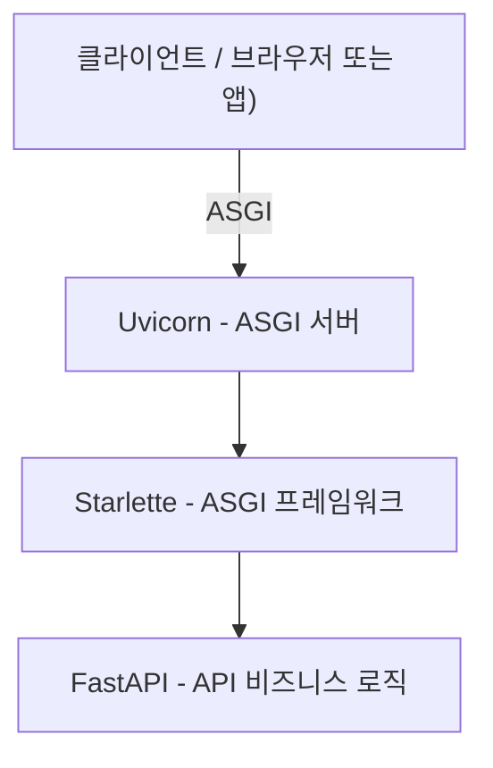

---
tags:
  - fastapi
  - ASGI
  - uvicorn
  - gunicorn
  - starlette
created: 2025-06-06T18:18:03
updated: 2025-06-07T00:24:47
---
### FastAPI란?

FastAPI는 Python으로 만든 최신 웹 프레임워크이다  
빠른 속도, 타입 힌트 지원, 자동 문서화, 비동기(Async) 지원 등의 강점이 있다  
RESTful API, 웹소켓 등 다양한 백엔드 기능을 쉽게 개발할 수 있게 해준다

---

### FastAPI와 관련 주요 용어

##### ASGI (Asynchronous Server Gateway Interface)

- Python에서 비동기 웹 서비스를 만들기 위한 인터페이스 (프로토콜, 표준)
- WSGI[^1]의 비동기 확장판으로, 동기(Sync)와 비동기(Async) 모두 지원
- FastAPI, Starlette, Django(3.x 이후) 등이 ASGI를 지원

##### Starlette

- Starlette는 ASGI 기반의 초경량 웹 프레임워크
- FastAPI는 Starlette 위에 만들어졌으며, Starlette가 FastAPI의 뼈대 역할
- 라우팅, 미들웨어, 요청/응답 처리 등 웹 프레임워크의 핵심 기능을 제공

##### Uvicorn

- Uvicorn은 ASGI 서버로, FastAPI (또는 Starlette) 앱을 실행시켜주는 서버
- 비동기 (Async) 지원, 빠르고 가벼움
- Flask에서의 WSGI 서버 (예: gunicorn, uwsgi 등)와 비슷한 역할

##### Gunicorn

- Gunicorn은 WSGI 서버로 널리 사용되어왔으나, 최근에는 ASGI 애플리케이션도 지원
- Uvicorn 워커(worker)와 조합해서 운영 환경에서 많이 사용
- Gunicorn은 멀티 프로세스 방식을 지원하여, 여러 Uvicorn 인스턴스를 관리

---

### FastAPI 전체 구조



운영 환경에서는 Gunicorn이 여러 개의 Uvicorn 프로세스를 관리하는 역할로 추가될 수 있음

---

### 요약 표

|    용어     |            설명             |    FastAPI와의 관계     |
| :-------: | :-----------------------: | :-----------------: |
|   ASGI    |    Python 비동기 서버 인터페이스    | FastAPI의 동작 기반 프로토콜 |
| Starlette |    ASGI 기반 경량 웹 프레임워크     |   FastAPI의 기반 뼈대    |
|  Uvicorn  |  ASGI 서버, FastAPI 실행 서버   | FastAPI를 실행시켜주는 서버  |
| Gunicorn  |   멀티 프로세스 WSGI/ASGI 서버    |  Uvicorn과 조합하여 운영   |
|  FastAPI  | Starlette 기반 최신 API 프레임워크 |    실제 API 작성 위치     |

---

### FastAPI 실행 예시

##### 개발(로컬)

```bash
uvicorn main:app --reload
```

```python
python -m fastapi dev app/main.py
```
##### 운영(배포)

```bash
gunicorn -k uvicorn.workers.UvicornWorker main:app
```

[^1]: Python 웹 서버와 웹 앱(프레임워크)을 연결해주는 동기 인터페이스
