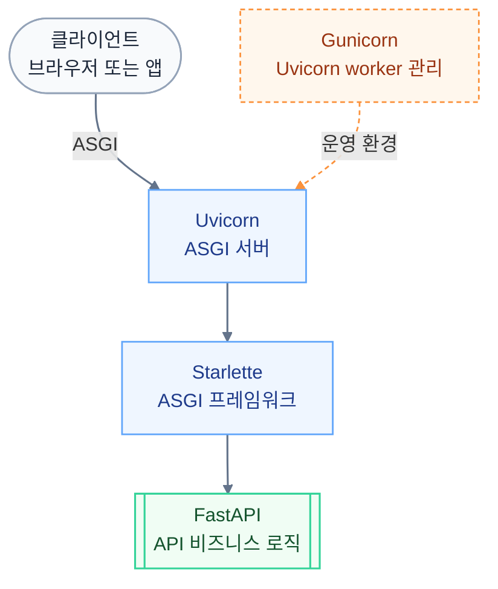

---
tags:
  - fastapi
  - ASGI
  - uvicorn
  - gunicorn
  - starlette
created: 2025-06-06T18:18:03
updated: 2026-04-20T22:23:40
---
### FastAPI란?

FastAPI는 Python으로 만든 최신 웹 프레임워크이다  
빠른 속도, 타입 힌트 지원, 자동 문서화, 비동기(Async) 지원 등의 강점이 있다  
RESTful API, 웹소켓 등 다양한 백엔드 기능을 쉽게 개발할 수 있게 해준다

---

### FastAPI와 관련 주요 용어

##### ASGI (Asynchronous Server Gateway Interface)

- Python에서 비동기 웹 서비스를 만들기 위한 인터페이스 (프로토콜, 표준)
- WSGI의 비동기 확장판으로, 동기(Sync)와 비동기(Async) 모두 지원
- FastAPI, Starlette, Django(3.x 이후) 등이 ASGI를 지원
- CGI → WSGI → ASGI로 이어지는 발전 과정은 [[WAS와 CGI, WSGI, ASGI - 웹 서버 아키텍처의 진화|웹 서버 아키텍처의 진화]] 참고

##### Starlette

- Starlette는 ASGI 기반의 초경량 웹 프레임워크
- FastAPI는 Starlette 위에 만들어졌으며, Starlette가 FastAPI의 뼈대 역할
- 라우팅, 미들웨어, 요청/응답 처리 등 웹 프레임워크의 핵심 기능을 제공

##### Uvicorn

- Uvicorn은 ASGI 서버로, FastAPI (또는 Starlette) 앱을 실행시켜주는 서버
- 비동기 (Async) 지원, 빠르고 가벼움
- Flask에서의 WSGI 서버 (예: gunicorn, uwsgi 등)와 비슷한 역할

##### Gunicorn

- Gunicorn은 WSGI 서버로 널리 사용되어왔으나, 최근에는 ASGI 애플리케이션도 지원
- Uvicorn 워커(worker)와 조합해서 운영 환경에서 많이 사용
- Gunicorn은 멀티 프로세스 방식을 지원하여, 여러 Uvicorn 인스턴스를 관리

---

### FastAPI 전체 구조



운영 환경에서는 Gunicorn이 여러 개의 Uvicorn 프로세스를 관리하는 역할로 추가될 수 있음

---

### 요약 표

|    용어     |            설명             |    FastAPI와의 관계     |
| :-------: | :-----------------------: | :-----------------: |
|   ASGI    |    Python 비동기 서버 인터페이스    | FastAPI의 동작 기반 프로토콜 |
| Starlette |    ASGI 기반 경량 웹 프레임워크     |   FastAPI의 기반 뼈대    |
|  Uvicorn  |  ASGI 서버, FastAPI 실행 서버   | FastAPI를 실행시켜주는 서버  |
| Gunicorn  |   멀티 프로세스 WSGI/ASGI 서버    |  Uvicorn과 조합하여 운영   |
|  FastAPI  | Starlette 기반 최신 API 프레임워크 |    실제 API 작성 위치     |

---

### FastAPI Tutorial
##### 패키지 설치
```
pip install "fastapi[all]"
```

##### 간단한 API 만들기
```python title="main.py"
from fastapi import FastAPI

# Create a FastAPI instance
app = FastAPI()


# path '/' 로 가서 GET operation 실행했을 때, 호출될 파이썬 함수
@app.get("/")
def read_root():
    return {"Hello": "World"}
```
##### 실행

`모듈명:변수명` 형식은 uvicorn/gunicorn CLI가 사용하는 문법이다. `main:app`이면 `main.py` 안의 `app` 변수를 가리킨다. 서브 디렉토리에 있으면 `app.main:app`처럼 점으로 구분한다.

```bash
# 개발 — 싱글 프로세스, 코드 변경 시 자동 재시작
uvicorn main:app --reload
python -m fastapi dev app/main.py
```

```bash
# 운영(배포) — Gunicorn이 멀티 프로세스를 관리하고, 각 워커에서 Uvicorn이 ASGI를 처리
gunicorn -k uvicorn.workers.UvicornWorker main:app
```

| 옵션 | 의미 |
| :--- | :--- |
| `-k` (`--worker-class`) | 워커 클래스 지정. 기본값은 `sync`(WSGI)이므로 ASGI 앱은 반드시 지정 필요 |
| `-w 4` | 워커 수. 보통 `CPU 코어 × 2 + 1` |
| `-b 0.0.0.0:8000` | 바인드 주소 |

```
Gunicorn (프로세스 매니저)
  ├── Uvicorn Worker 1  ← ASGI 처리
  ├── Uvicorn Worker 2  ← ASGI 처리
  └── Uvicorn Worker 3  ← ASGI 처리
```

Uvicorn 단독으로는 싱글 프로세스라 CPU 코어를 다 활용하지 못한다. Gunicorn이 여러 Uvicorn 워커를 띄워서 관리하는 구조다.
##### Path Parameter
```python title="path_param.py"
from fastapi import FastAPI

# Create a FastAPI instance
app = FastAPI()

# item_id가 Path Parameter. function에 argument로 전달
@app.get("/items/{item_id}")
def read_item(item_id: int):
    return {"item_id": item_id}
```

##### Query Parameter
```python title="query_param.py"
from fastapi import FastAPI

# Create a FastAPI instance
app = FastAPI()

fake_items_db = [{"item_name": "Foo"}, {"item_name": "Bar"}, {"item_name": "Baz"}]

# function parameter에 포함되지만, Path Operation에 포함 X
# http://localhost:8000/items/?skip=0&limit=10 으로 접근
@app.get("/items/")
def read_item(skip: int = 0, limit: int = 10):
    return fake_items_db[skip : skip + limit]
```

##### Multiple Path and Query Parameters
```python title="multi_param.py"
# multi_param.py
from typing import Union
from fastapi import FastAPI

# Create a FastAPI instance
app = FastAPI()

# Path Parameter + Query Parameter
@app.get("/users/{user_id}/items/{item_id}")
def read_user_item(user_id: int, item_id: str, q: Union[str, None] = None, short: bool = False):
    item = {"item_id": item_id, "owner_id": user_id}
    if q:
        item.update({"q": q})
    if not short:
        item.update(
            {"description": "This is an amazing item that has a long description"},
        )
    return item
```

### FastAPI CRUD
- CREATE / READ / UPDATE / DELETE 기능을 Path Parameter, Query Parameter, Pydantic을 활용해 구현 가능
##### Path Parameter CRUD
- CREATE : `POST /users/name/{name}/nickname/{nickname}`
- READ : `GET /users/name/{name}`
- UPDATE : `PUT /users/name/{name}/nickname/{nickname}`
- DELETE : `DELETE /users/name/{name}`

```python title="crud_path.py"
from fastapi import FastAPI, HTTPException

# Create a FastAPI instance
app = FastAPI()

# User database
USER_DB = {}

# Fail response
NAME_NOT_FOUND = HTTPException(status_code=400, detail="Name not found.")


@app.post("/users/name/{name}/nickname/{nickname}")
def create_user(name: str, nickname: str):
    USER_DB[name] = nickname
    return {"status": "success"}


@app.get("/users/name/{name}")
def read_user(name: str):
    if name not in USER_DB:
        raise NAME_NOT_FOUND
    return {"nickname": USER_DB[name]}


@app.put("/users/name/{name}/nickname/{nickname}")
def update_user(name: str, nickname: str):
    if name not in USER_DB:
        raise NAME_NOT_FOUND
    USER_DB[name] = nickname
    return {"status": "success"}


@app.delete("/users/name/{name}")
def delete_user(name: str):
    if name not in USER_DB:
        raise NAME_NOT_FOUND
    del USER_DB[name]
    return {"status": "success"}
```

##### Query Parameter CRUD
- CREATE : `POST /users?name=hello&nickname=world`
- READ : `GET /users?name=hello`
- UPDATE : `PUT /users?name=hello&nickname=world2`
- DELETE : `DELETE /users?name=hello`
```python title="crud_query.py"
from fastapi import FastAPI, HTTPException

# Create a FastAPI instance
app = FastAPI()

# User database
USER_DB = {}

# Fail response
NAME_NOT_FOUND = HTTPException(status_code=400, detail="Name not found.")


@app.post("/users")
def create_user(name: str, nickname: str):
    USER_DB[name] = nickname
    return {"status": "success"}


@app.get("/users")
def read_user(name: str):
    if name not in USER_DB:
        raise NAME_NOT_FOUND
    return {"nickname": USER_DB[name]}


@app.put("/users")
def update_user(name: str, nickname: str):
    if name not in USER_DB:
        raise NAME_NOT_FOUND
    USER_DB[name] = nickname
    return {"status": "success"}


@app.delete("/users")
def delete_user(name: str):
    if name not in USER_DB:
        raise NAME_NOT_FOUND
    del USER_DB[name]
    return {"status": "success"}
```

##### Pydantic CRUD
- 기능
	- 데이터 검증 및 타입안정성 (BaseModel)
		- CreateIn : 입력받는 데이터 형태 지정
		- CreateOut : 반환하고자 하는 데이터 형태 지정
	- 코드 가독성 및 유지보수성 향상
	- 보안 및 정보 노출 최소화 : Response Model 별도 지정해서 비밀번호와 같은 민감한 정보 응답에서 제외 가능
	- 자동 변환 및 직렬화 (Python ↔ JSON)

```python title="crud_pydantic.py"
from fastapi import FastAPI, HTTPException
from pydantic import BaseModel

class CreateIn(BaseModel):
    name: str
    nickname: str

class CreateOut(BaseModel):
    status: str
    id: int

# Create a FastAPI instance
app = FastAPI()

# User database
USER_DB = {}

# Fail response
NAME_NOT_FOUND = HTTPException(status_code=400, detail="Name not found.")


@app.post("/users", response_model=CreateOut)
def create_user(user: CreateIn):
    USER_DB[user.name] = user.nickname
    user_dict = user.dict()
    user_dict["status"] = "success"
    user_dict["id"] = len(USER_DB)
    return user_dict


@app.get("/users")
def read_user(name: str):
    if name not in USER_DB:
        raise NAME_NOT_FOUND
    return {"nickname": USER_DB[name]}


@app.put("/users")
def update_user(name: str, nickname: str):
    if name not in USER_DB:
        raise NAME_NOT_FOUND
    USER_DB[name] = nickname
    return {"status": "success"}


@app.delete("/users")
def delete_user(name: str):
    if name not in USER_DB:
        raise NAME_NOT_FOUND
    del USER_DB[name]
    return {"status": "success"}
```


