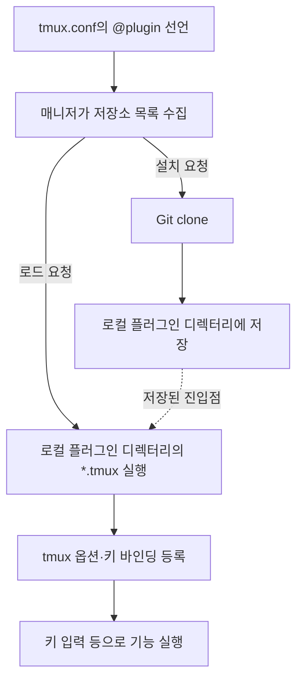

---
tags:
  - tmux
  - terminal
  - plugin
created: 2026-09-28T09:23:50
updated: 2026-09-28T13:29:39
permalink: /Dev/workflow/tpm-and-tpack
---

> [!abstract]+ TL;DR
> - Git 저장소 설치와 `*.tmux` 실행을 담당하는 TPM·tpack의 공통 구조
> - 설정 파일과 단축키 중심의 TPM, TUI 검색·관리를 추가한 tpack
> - 저장소 배포와 검색 목록 등록의 분리, tpack 전환 시 설치 경로 확인 필요

> *AI-assisted*

### 1. 플러그인 매니저의 역할과 차이

[[터미널 멀티플렉서와 tmux|tmux]]에 테마나 키 바인딩을 추가할 때는 플러그인의 코드를 내려받고 시작 스크립트를 실행해야 한다. 플러그인 매니저는 설정 파일에 적힌 저장소를 읽어 설치·업데이트·로드를 담당한다.

[TPM](https://github.com/tmux-plugins/tpm)은 shell script로 구현한 매니저다. [tpack](https://github.com/tmuxpack/tpack)은 TPM의 플러그인 선언 문법을 지원하며 Go로 구현한 CLI와 TUI를 제공한다.

| 비교 항목 | TPM | tpack |
| --- | --- | --- |
| 플러그인 선언 | 설정 파일의 `set -g @plugin` | 같은 문법 지원 |
| 관리 화면 | 단축키와 shell script | 단축키, CLI, TUI |
| 검색 | 내장 검색 화면 없음 | registry 기반 TUI 검색 |
| 저장소 주소로 설치 | 검색 목록 등록 불필요 | 검색 목록 등록 불필요 |
| 설치 디렉터리 이름 | 보통 저장소의 마지막 이름 | 기본적으로 저장소 이름과 식별용 해시 조합 |

> [!note]+ 확인 기준: 공식 저장소의 구현
> - 2026-09-28에 확인한 TPM `e261deb`, tpack `1f8b694` 기준.
> - 설치 경로와 세부 명령 동작은 버전에 따라 달라질 수 있음.

---

### 2. 사용자가 선언하고 설치하는 과정

예시는 tmux와 Git이 설치되어 있고 `~/.tmux.conf`를 사용하는 환경을 기준으로 한다. TPM과 standalone tpack 중 하나를 선택한다.

#### 2.1. TPM

1. **매니저 설치**: TPM 저장소를 내려받는다.

```bash
git clone https://github.com/tmux-plugins/tpm ~/.tmux/plugins/tpm
```

2. **플러그인 선언**: `~/.tmux.conf`에 설치할 저장소를 적고 파일 마지막에서 TPM을 실행한다.

```tmux
set -g @plugin 'tmux-plugins/tpm'
set -g @plugin 'tmux-plugins/tmux-sensible'

# 설정 파일 마지막에 배치
run '~/.tmux/plugins/tpm/tpm'
```

3. **설정 적용**: 실행 중인 tmux 세션에서 설정 파일을 다시 읽는다.

```bash
tmux source-file ~/.tmux.conf
```

4. **플러그인 설치**: prefix를 누른 뒤 대문자 `I`를 누른다. TPM은 선언한 저장소를 clone하고 플러그인을 로드한다.

> [!note]+ prefix: tmux 단축키의 시작 키
> - 기본값은 `Ctrl-b`이며 설정에서 변경 가능.
> - `prefix + I`는 prefix를 누르고 손을 뗀 뒤 `Shift-i`를 누르는 순서.
> - XDG 경로를 쓰는 환경에서는 예시의 설정 파일 경로를 실제 `tmux.conf` 경로로 변경.

#### 2.2. tpack

1. **매니저 설치**: macOS의 Homebrew 환경에서는 공식 tap으로 설치한다.

```bash
brew install tmuxpack/tpack/tpack
```

2. **플러그인 선언**: `~/.tmux.conf`에 같은 형식으로 저장소를 적고 마지막에 tpack을 초기화한다.

```tmux
set -g @plugin 'tmux-plugins/tmux-sensible'

# 설정 파일 마지막에 배치
run 'tpack init'
```

3. **설정 적용과 설치**: 설정을 reload한 뒤 `prefix + I`로 설치 화면을 연다.

```bash
tmux source-file ~/.tmux.conf
```

CLI로 설치할 때는 아래 순서로 실행한다.

```bash
tpack install
tmux source-file ~/.tmux.conf
```

- **설치**: 인자 없는 `tpack install`은 설정 파일에 선언된 플러그인을 내려받는다.
- **로드**: 현재 구현의 [install 명령](https://github.com/tmuxpack/tpack/blob/1f8b694855c0ebf6169a775b1aa2fc55117aba49/cmd/tpack/install.go)은 기본 실행 시 설정을 자동 reload하지 않는다. 뒤의 `source-file`이 `tpack init`을 다시 실행해 새 플러그인을 로드한다.
- **검색**: `prefix + T`로 TUI를 열고 검색 화면에서 registry의 플러그인을 찾는다.

#### 2.3. 업데이트와 정리

| 작업 | TPM | tpack |
| --- | --- | --- |
| 선언한 플러그인 설치 | `prefix + I` | `prefix + I` |
| 플러그인 업데이트 | `prefix + U` | `prefix + U` |
| 선언에서 빠진 플러그인 정리 | `prefix + Alt-u` | `prefix + Alt-u` |
| 관리 TUI 열기 | 기본 제공 없음 | `prefix + T` |

플러그인을 정리할 때는 설정의 선언을 지우거나 주석 처리한 뒤 정리 단축키를 누른다.

> [!warning]+ 제거 범위: 파일과 실행 중인 설정
> - 플러그인 디렉터리를 삭제해도 이미 등록한 키 바인딩이나 옵션이 남을 수 있음.
> - 실행 중인 tmux의 설정을 되돌리려면 플러그인이 제공하는 해제 방법이나 관련 설정 재적용 필요.

---

### 3. 선언에서 플러그인 실행까지

설치와 로드는 서로 다른 단계다. 설치는 Git 저장소를 로컬에 준비하고 로드는 그 안의 진입점을 실행한다.



- **전달하는 값**: 선언에는 GitHub의 `OWNER/REPO` 약식 주소나 지원하는 Git 저장소 URL을 적는다.
- **설치 결과**: 매니저가 로컬에 저장소를 clone한다. 이후 업데이트에서는 설치한 저장소를 갱신한다.
- **실행 결과**: 플러그인의 진입점이 tmux 명령으로 옵션과 키 바인딩을 설정하고 필요한 스크립트를 연결한다.

> [!note]+ 선언 수집: 설정 파일을 읽는 매니저
> - TPM의 [목록 수집 함수](https://github.com/tmux-plugins/tpm/blob/e261deb1b47614eed3400089ce7197dc68acc4eb/scripts/helpers/plugin_functions.sh)는 설정 파일에서 `@plugin` 선언 줄을 추출함.
> - tpack의 [GatherPlugins](https://github.com/tmuxpack/tpack/blob/1f8b694855c0ebf6169a775b1aa2fc55117aba49/internal/config/tmuxconf.go)도 설정 파일과 불러온 설정의 선언을 수집함.
> - 여러 `set -g @plugin` 줄을 설치 목록으로 취급하는 것은 매니저의 동작이며 tmux의 일반 옵션 값 하나에 목록을 누적하는 방식과 구분.

[TPM의 로더](https://github.com/tmux-plugins/tpm/blob/e261deb1b47614eed3400089ce7197dc68acc4eb/scripts/source_plugins.sh)와 [tpack의 로더](https://github.com/tmuxpack/tpack/blob/1f8b694855c0ebf6169a775b1aa2fc55117aba49/internal/manager/source.go)는 플러그인 루트의 `*.tmux` 파일을 찾아 실행한다. 진입점이 여러 개면 모두 실행하므로 보조 스크립트는 별도 디렉터리에 두고 진입점에서 호출하는 구성이 일반적이다.

---

### 4. 제작자가 설치 가능한 플러그인을 배포하기

[TPM의 플러그인 작성 규약](https://github.com/tmux-plugins/tpm/blob/master/docs/how_to_create_plugin.md)에 맞춰 Git 저장소와 실행 가능한 진입점을 준비한다. 예를 들어 `hello.tmux`에 다음 내용을 저장한다.

```bash
#!/usr/bin/env bash

tmux bind-key H display-message 'Hello from plugin'
```

저장소 루트에서 실행 권한을 부여하고 Git에 기록한다.

```bash
chmod +x hello.tmux
git add hello.tmux
git commit -m 'Add tmux plugin entry point'
```

1. **동작 확인**: tmux 세션에서 진입점을 실행하고 `prefix + H`로 메시지가 표시되는지 확인한다.
2. **사용법 작성**: README에 플러그인 선언, 키 바인딩, 지원 환경과 외부 의존성을 적는다.
3. **저장소 배포**: 원격 Git 저장소에 push하고 사용자가 접근할 주소를 안내한다.

직접 실행해 확인하는 명령은 다음과 같다.

```bash
./hello.tmux
```

- **매니저의 책임**: 저장소 다운로드·업데이트와 진입점 실행.
- **플러그인의 책임**: 기능 구현과 필요한 외부 도구의 확인·호출.
- **외부 의존성**: `fzf`, `jq`나 별도 바이너리가 필요하면 제작자가 설치 절차를 구현하거나 README에서 별도 설치를 안내한다.

> [!note]+ 진입점: 실행 가능한 스크립트
> - 위 예시의 `.tmux` 파일은 shebang으로 Bash를 지정하고 tmux 명령을 실행함.
> - 접근 가능한 저장소와 실행 가능한 진입점을 준비하면 검색 목록 승인 없이 주소를 지정해 설치 가능.
> - 매니저가 모든 플러그인의 외부 의존성을 자동 설치해 주는 것은 아님.

---

### 5. 배포한 플러그인을 검색 목록에 등록하기

저장소를 배포하면 사용자는 주소를 지정해 설치한다. 검색 목록 등록은 사용자가 플러그인을 발견하도록 이름·설명·주소를 목록에 추가하는 절차다.

| 구분 | TPM | tpack |
| --- | --- | --- |
| 주소를 지정한 설치 | 중앙 등록이나 승인 불필요 | 중앙 등록이나 승인 불필요 |
| 검색 목록 | 커뮤니티의 추천 문서 등을 별도로 이용 | TUI가 plugins-registry의 목록 사용 |
| 목록에 제안 | 각 추천 목록의 기여 규칙에 따라 제안 | `tmuxpack/plugins-registry`에 PR 제출 |
| 목록 반영 결정 | 목록 관리자 | registry maintainer |

#### 5.1. tpack registry의 등록 절차

[tpack registry 기여 안내](https://github.com/tmuxpack/plugins-registry/blob/main/CONTRIBUTING.md)는 다음 절차를 제시한다.

1. **Fork**: registry 저장소를 자신의 계정으로 fork한다.
2. **항목 추가**: `plugins/utility.yml`처럼 알맞은 분류 파일에 항목을 추가한다.
3. **PR 제출**: 원본 registry 저장소로 변경을 제안한다.
4. **검증과 반영**: CI가 형식·저장소 존재 여부·중복을 검사하고 maintainer가 검토해 merge한다.

아래는 GitHub 저장소를 추가하는 YAML 형식이다. `your-username/your-plugin`은 실제 공개 저장소 주소로 바꾼다.

```yaml
- repo: your-username/your-plugin
  description: Show a greeting in the tmux status line
  author: your-username
```

> [!note]+ 등록 필드: registry의 요구사항
> - **repo**: 접근 가능한 공개 저장소의 `user/repo` 형식.
> - **description**: 10~200자 설명.
> - **author**: 저장소 호스트의 사용자 이름.
> - **host**: GitHub 외 호스트라면 `gitlab.com` 등 도메인 추가.
> - **stars**: CI가 관리하므로 직접 추가하지 않음.

#### 5.2. 검색 화면이 목록을 읽는 원리

```text
분류별 plugins/*.yml
        │ CI에서 목록 생성
        ▼
dist/plugins.yml
        │ HTTP로 다운로드
        ▼
tpack의 로컬 registry 캐시
        │ 이름·설명 검색
        ▼
TUI에서 선택한 Git 저장소
        │ 설치 요청
        ▼
설정에 선언 추가 + 저장소 clone
```

- **전달하는 데이터**: registry에는 저장소 주소·설명·분류 등의 메타데이터가 들어간다. 플러그인 코드는 선택한 Git 저장소에서 받는다.
- **검색 동작**: [검색 구현](https://github.com/tmuxpack/tpack/blob/1f8b694855c0ebf6169a775b1aa2fc55117aba49/internal/registry/registry.go)은 목록의 저장소 이름과 설명에서 검색어를 찾는다.
- **설정 기록**: 검색 화면에서 설치한 항목은 [설정 기록 함수](https://github.com/tmuxpack/tpack/blob/1f8b694855c0ebf6169a775b1aa2fc55117aba49/internal/config/writer.go)가 `@plugin` 선언으로 추가한다.

> [!note]+ 캐시: 검색 목록의 갱신 시점
> - [registry 다운로드 구현](https://github.com/tmuxpack/tpack/blob/1f8b694855c0ebf6169a775b1aa2fc55117aba49/internal/registry/fetch.go)의 기본 캐시 유효 시간은 6시간.
> - PR merge 후 배포 목록 생성과 사용자 캐시 갱신 시점에 따라 검색 반영이 늦어질 수 있음.
> - 다운로드 실패 시 기존 캐시를 사용하며 캐시도 없으면 오류 반환.

---

### 6. 선택과 전환 시 확인할 사항

- **TPM**: 설정 파일에 저장소를 직접 적고 단축키로 설치·업데이트하는 작업 방식에 적합하다.
- **tpack**: 같은 선언 문법을 유지하면서 검색 화면과 TUI에서 플러그인을 관리하려는 경우에 적합하다.

TPM에서 standalone tpack으로 바꿀 때는 기존 TPM 초기화 줄을 tpack 초기화 줄로 교체한다. 플러그인 선언은 유지하되 TPM 자체를 선언한 줄은 제거한다.

```tmux
# 플러그인 선언 아래, 설정 파일 마지막에 배치
run 'tpack init'
```

> [!warning]+ 설치 경로: 현재 tpack과 TPM의 차이
> - tpack은 기본적으로 `tmux-87a1216f1f68`처럼 저장소별 해시를 붙여 같은 이름의 저장소를 구분함.
> - tpack이 기존 플러그인 디렉터리를 새 규칙에 맞춰 변경하므로 경로를 직접 적은 설정과 스크립트 확인 필요.
> - 공식 README는 TPM과 tpack이 같은 플러그인 루트를 함께 관리하는 구성을 지원하지 않는다고 명시.
> - TPM으로 돌아갈 때도 디렉터리 이름과 경로를 확인하고 필요하면 TPM으로 플러그인을 다시 설치.
